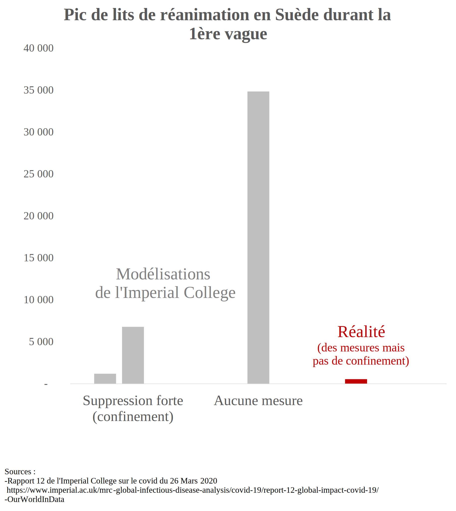
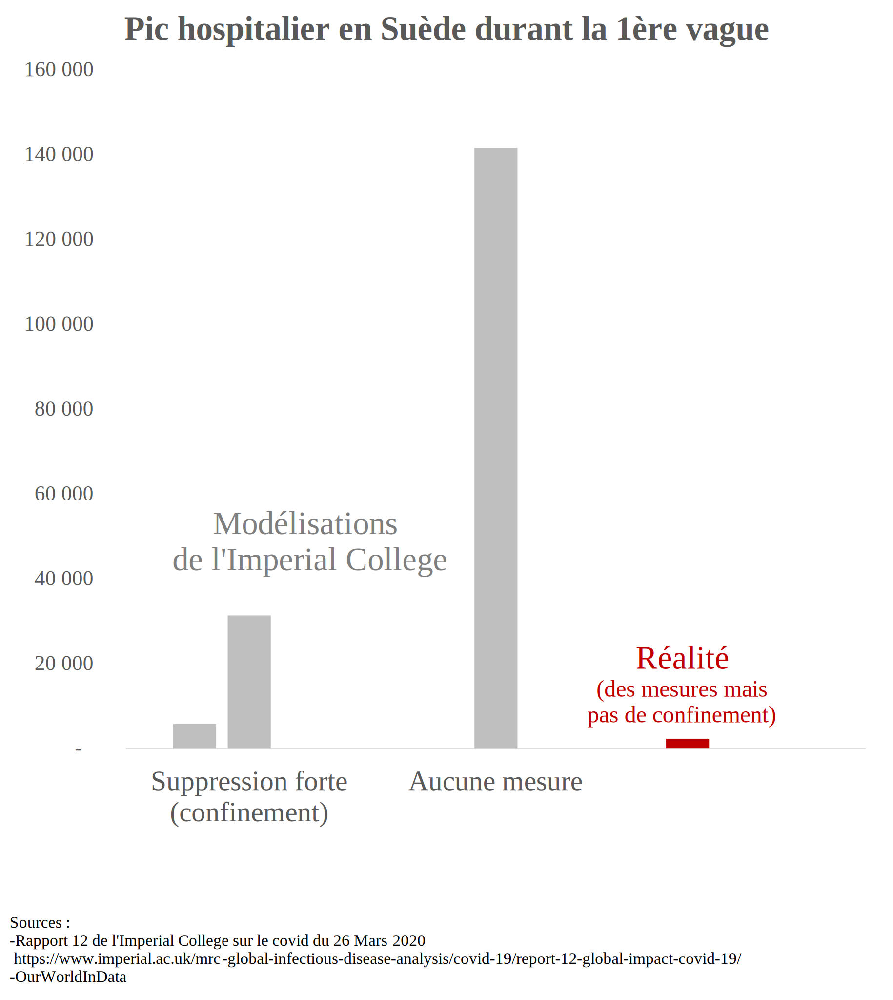
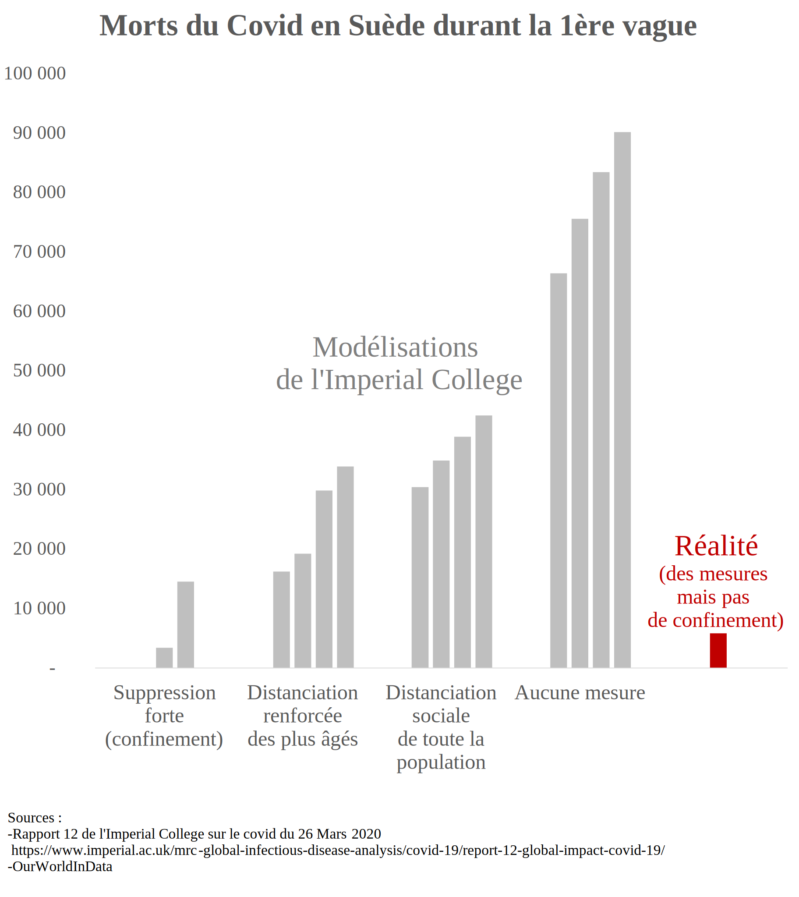
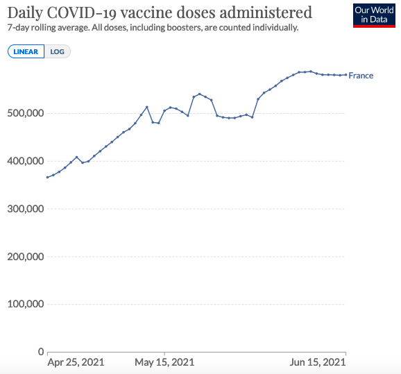
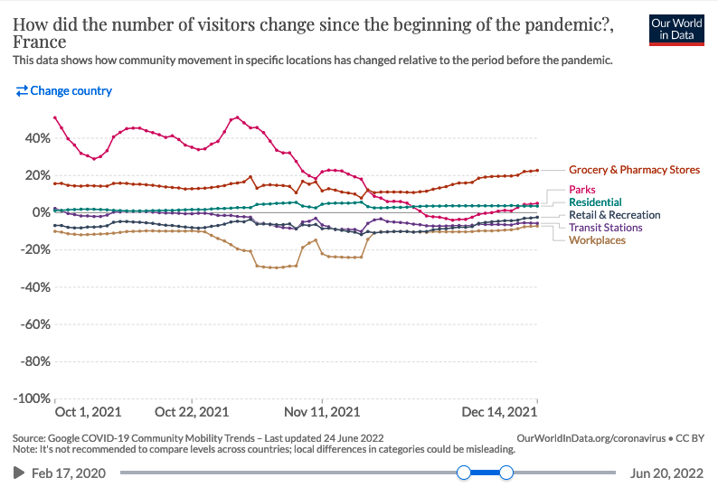
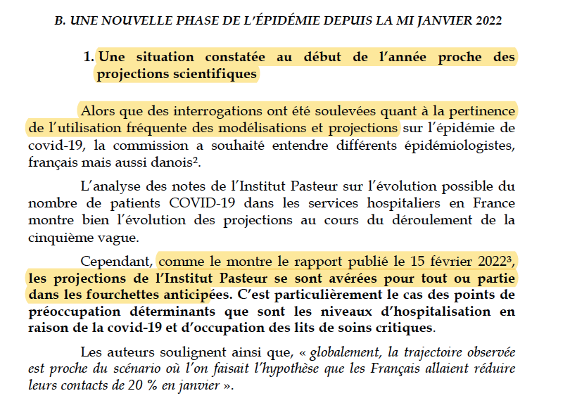

```{r setup, include=FALSE}
knitr::opts_chunk$set(echo = F, message=F, warning=F, fig.align = "center",  dev='svg')
library(plyr)
library(lattice)
library(lubridate)
library(svglite)

#loading relevant packages
library(zoo) #for rollmean function
library(tidyr)
library(tidyverse) #mainly for reading files functions
library(dplyr)
library(ggplot2) #for ggplot graphs
library(cowplot) #for plot_grid()
library(stringr) #to manipulate strings

theme_set(
  theme_classic() +
  theme(legend.position = "none", 
        legend.title = element_blank(),
        panel.grid.major.y = element_line(),
        text = element_text(family = "Times New Roman"),
        plot.title = element_text(face="bold"),
        axis.title.x = element_blank(),
        axis.title.y = element_blank())
  )
g_theme <- scale_color_manual(values=c('#ff0000','#D8D8D8'))
myred <- '#ff0000'
mygrey <- '#b4b4b4'
#height and width of graphs
w <- 4.5
h <- 5.2
```

```{r loading_true _data}
data_gouv_new_hosp_rea <- 
  read.csv(url("https://www.data.gouv.fr/fr/datasets/r/6fadff46-9efd-4c53-942a-54aca783c30c"), sep=";") %>%
  mutate(date = as.Date(jour))
data_gouv_beds_hosp_rea <- 
  read.csv(url("https://www.data.gouv.fr/fr/datasets/r/63352e38-d353-4b54-bfd1-f1b3ee1cabd7"), sep=";")  %>%
  mutate(date = as.Date(jour))

#Lits occupés en réanimation, hospitalisation et hospitalisation conventionnelle
true_data_beds_hosp_rea <- data_gouv_beds_hosp_rea %>%
  filter(sexe =="0", # 0 = hommes + femmes, 1=hommes, 2=femmes
         #enlève l'Outre-Mer car les scénarios de Pasteur uniquement pour la France Métropolitaine
         dep != 971 & dep != 972 & dep != 973 & dep != 974 & dep != 976 & dep != 978) %>%
  group_by(date) %>% #grouper tous les départements ensembles
  dplyr::summarise(hosp = sum(hosp, na.rm = T), 
            rea = sum(rea, na.rm = T),
            HospConv = sum(HospConv, na.rm = T))

#pour les echos pasteur 29 avril ile de france
true_data_beds_hosp_rea_IDF <- data_gouv_beds_hosp_rea %>%
  filter(sexe =="0", # 0 = hommes + femmes, 1=hommes, 2=femmes
         #enlève l'Outre-Mer car les scénarios de Pasteur uniquement pour la France Métropolitaine
         dep == 75 | dep == 92 | dep == 93 | dep == 94 | dep == 91 | dep == 95 | dep == 78 | dep == 77) %>% 
  group_by(date) %>% #grouper tous les départements ensembles
  dplyr::summarise(hosp = sum(hosp, na.rm = T), 
            rea = sum(rea, na.rm = T),
            HospConv = sum(HospConv, na.rm = T))

#Nouvelles admissions à l'hôpital et en réanimation (moyenné sur 7 jours)
true_data_new_hosp_rea <- data_gouv_new_hosp_rea %>% 
  filter( #enlève l'Outre-Mer car les scénarios de Pasteur uniquement pour la France Métropolitaine
         dep != 971 & dep != 972 & dep != 973 & dep != 974 & dep != 976 & dep != 978) %>% 
  group_by(date) %>% #grouper tous les départements ensembles
  dplyr::summarise(incid_hosp = sum(incid_hosp, na.rm = T), 
            incid_rea = sum(incid_rea, na.rm = T)) %>%
  mutate(
    new_rea_right = rollmean(incid_rea, 7, na.pad = T, align = "right"),#mean of 7 last days
    new_hosp_right = rollmean(incid_hosp, 7, na.pad = T, align = "right"),
    new_rea_center = rollmean(incid_rea, 7, na.pad = T, align = "center"),#centered mean
    new_hosp_center = rollmean(incid_hosp, 7, na.pad = T, align = "center"),
    new_rea_left = rollmean(incid_rea, 7, na.pad = T, align = "left"),#mean of 7 next days
    new_hosp_left = rollmean(incid_hosp, 7, na.pad = T, align = "left")
    )

true_data_new_hosp_rea_no_mean <- data_gouv_new_hosp_rea %>% 
  filter( #enlève l'Outre-Mer car les scénarios de Pasteur uniquement pour la France Métropolitaine
    dep != 971 & dep != 972 & dep != 973 & dep != 974 & dep != 976 & dep != 978) %>% 
  group_by(date) %>% #grouper tous les départements ensembles
  dplyr::summarise(new_hosp = sum(incid_hosp, na.rm = T), 
            new_rea = sum(incid_rea, na.rm = T))

#Pour l'INSERM : admissions hebdomadaire à l'hôpital
true_data_new_hosp_rea_weekly <- data_gouv_new_hosp_rea %>% 
  group_by(date) %>% #je n'ai pas filtré les outre-mer ici car pas précisé, mais ne change pas grand-chose
  dplyr::summarise(incid_hosp = sum(incid_hosp, na.rm = T)) %>%
  mutate(new_hosp_week = rollsum(incid_hosp, 7, na.pad = T, align = "left")) #patients arrivés dans les 7 derniers jours)

```

# Avant d'explorer les scénarios de modélisation

<details>

<summary>

**Quel intérêt à étudier la fiabilité des scénarios de modélisations ?** ***(cliquer pour dérouler)***

</summary>

Dans un cas de figure où les scénarios de modélisation sous-estiment l'évolution de l'épidémie (A), le risque est de ne pas réagir, ou pas assez. Inversement, si les scénarios surestiment l'évolution de l'épidémie (B), le risque est de surréagir et notamment de prendre trop de mesures aux effets délétères sans qu'elles soient justifiées. En effet, la plupart des mesures de freinage de l'épidémie (confinement, couvre-feu, fermeture de classes, fermetures de lieux publics) ont des impacts sanitaires, sociaux et économiques négatifs. Par conséquent, surréagir face à l'épidémie n'est pas une bonne chose (de même que ne pas réagir assez).

<center>

{width="800"}

</center>

Une explication plus détaillée est disponible sur la page [Impact](https://evaluation-modelisation-covid.github.io/france/impact).

</details>

<details>

<summary>

**L'intérêt des modélisations n'est-il pas justement d'empêcher qu'elles se produisent ?** ***(cliquer pour dérouler)***

</summary>

Un argument souvent entendu au sujet des scénarios de modélisation est le suivant : comme le scénario permet d'anticiper le pire, il mène à prendre des mesures qui vont justement empêcher que le scénario modélisé se produise, ce qui explique le décalage entre le scénario de modélisation et la réalité (où des mesures de freinage ont été prises!). Effectivement, il n'est pas possible d'établir une comparaison dans ce cas de figure.

<center>

{width="500"}

</center>

Cependant, les scénarios de modélisation intègrent souvent plusieurs hypothèses sur les mesures de freinage qui pourraient être mises en place. Ici, nous ne comparerons la réalité qu'avec des scénarios où les mesures de freinage mises en place avaient aussi été modélisées.

<center>

{width="500"}

</center>

Ainsi, la comparaison entre scénarios de modélisation et réalité permettra bien d'évaluer si ceux-ci ont bien anticipé la réalité.

A titre d'exemple, l'Institut Pasteur a produit des scénarios le 7 juillet 2021 dans le contexte de la 1ère vague delta. L'annonce de la mise en place du pass sanitaire le 12 juillet rend la comparaison de ces scénarios à la réalité illégitime. En revanche il est possible de comparer les scénarios ultérieurs du 26 juillet et du 5 août.

</details>

# Retour sur les principaux scénarios de modélisation

## 1. Mars 2020, les modélisations qui ont conduit le monde à se confiner

<details>

<summary>

**Contexte** ***(cliquer pour dérouler)***

</summary>

En **mars 2020**, l'incertitude sur les conséquences qu'allaient avoir le covid-19 était grande. Lorsque l'Italie a commencé à être fortement touchée à la mi-mars, de nombreux pays européens ont réalisé que le covid-19 allait avoir un impact significatif. Pour anticiper l'évolution de la pandémie, les décideurs se sont tournés vers le domaine de la modélisation épidémiologique.

**Une équipe de scientifiques de l'Imperial College (Londres)**, menée par le Professeur Neil Ferguson, a notamment publié le 16 mars le [rapport](https://www.imperial.ac.uk/mrc-global-infectious-disease-analysis/covid-19/report-9-impact-of-npis-on-covid-19/) qui a conduit de nombreux gouvernements européens, dont le [gouvernement français](https://www.lemonde.fr/planete/article/2020/03/15/coronavirus-les-simulations-alarmantes-des-epidemiologistes-pour-la-france_6033149_3244.html), à confiner leur pays. Les scénarios présentés dans le rapport anticipaient, **en l'absence de mesures strictes, de l'ordre de 500 000 morts en moins de 3 mois au Royaume-Uni**, et des chiffres similaires pour la France. **La mise en œuvre de mesures standard** telles que celles prévues dans les plans de préparation à la pandémie (stratégie d'atténuation) **entraînerait 250 000 décès**. Selon le rapport, seule la mise en œuvre de mesures plus strictes pour supprimer le virus (comme le confinement) permettrait de contenir la vague et serait le seul moyen d'éviter la saturation du système hospitalier. **Selon les chercheurs, le confinement représentait "l'option politique privilégiée"**. Se fiant à ce rapport, les gouvernements ont pour beaucoup choisi de mettre en place des mesures de confinement.

Bien évidemment, les projections décrivant ce qu'il devrait se passer en l'absence de mesures ne peuvent être comparées avec ce qui s'est réellement passé dans les pays confinés. C'est d'ailleurs l'un des contre-arguments les plus communs: c'est précisément grâce aux mesures que les scénarios de modélisation pessimistes ne se sont pas réalisés.

Cependant, un pays permet de tester la validité des scénarios de modélisation : la Suède. Lors de la première vague, **la Suède a choisi de ne pas se confiner**, préférant se reposer des mesures plus légères. Il est **donc possible de comparer ce qu'anticipaient les modélisations** pour la Suède et la réalité.

</details>

<details>

<summary>

**Comparaison des scénarios aux données réelles** ***(cliquer pour dérouler)***

</summary>

[L'appendice](https://www.imperial.ac.uk/media/imperial-college/medicine/mrc-gida/Imperial-College-COVID19-Global-unmitigated-mitigated-suppression-scenarios.xlsx) du [rapport 12](https://www.imperial.ac.uk/mrc-global-infectious-disease-analysis/covid-19/report-12-global-impact-covid-19/) de l'Imperial College, publié le 26 mars, contient des modélisations de l'épidémie en Suède.

Les **2 premiers graphiques** représentent les **pics de lits occupés en réanimation et à l'hôpital**. Les barres grises représentent les scénarios de l'Imperial College : confinement strict précoce, confinement strict tardif, et aucune mesure. Les barres rouges représentent la réalité. La Suède ayant mis en place des mesures de distanciation sociale sans pour autant imposer un confinement, les chiffres observés auraient dû se trouver quelque part entre les scénarios *confinement* et *aucune mesure*.

Alors même que la Suède n'a PAS confiné sa population, les scénarios AVEC confinement surestiment le pic de lits utilisés d'un facteur 2 à 10. Un scénario avec des restrictions plus légères devrait se situer entre les scénarios *confinement* et le scénario *aucune restriction*, ce qui donne **une surestimation d'un facteur 10 à 60**.

La **dernière figure** présente en gris les différents scénarios de l'Imperial College **relatifs à la mortalité**, et en rouge le nombre de morts réels. Là encore, les scénarios surestiment largement la mortalité. Le nombre de morts réels correspond au scénario de confinement précoce, ce qui n'a évidemment pas été l'approche suivie par la Suède. Les scénarios intermédiaires de distanciation sociale **surestiment quant à eux la mortalité d'un facteur 3 à 7**.

</details>

### {.tabset .tabset-fade .tabset-pills}

```{r test}
# temp <- read_csv("data/2020_03_26_Imperial_Sweden/Sweden_Imperial_deaths.csv")
# temp$NPI <- as.factor(temp$NPI)
# temp$NPI <- ordered(temp$NPI, levels = c(
#   "Suppression forte (confinement)",
#   "Distanciation renforcée des plus âgés",
#   "Distanciation sociale de toute la population",
#   "Aucune mesure",
#   "Réalité"))
# ggplot(temp) + geom_col(aes(number, deaths, fill = scenario)) + 
#   facet_grid(~NPI, switch = "x", labeller = label_wrap_gen(width=10)) +
#     theme(axis.title.x=element_blank(),
#         axis.text.x=element_blank(),
#         axis.ticks.x=element_blank()) +
#   scale_fill_manual(values = c("reality" = myred,
#                                "scenario" = mygrey))
                                
```


#### Pic de réanimation

```{r Sweden_Imperial_ICU_peak, echo=FALSE, out.width="500px"}

```

#### Pic hospitalier

```{r Sweden_Imperial_hosp_peak, echo=FALSE, out.width="500px"}

```

#### Décès

```{r Sweden_Imperial_deaths, echo=FALSE, out.width="500px"}

```

###

<details>

<summary>

**Impact politique et médiatique** ***(cliquer pour dérouler)***

</summary>

Ces modélisations furent un des principaux éléments déclencheurs du confinement national français, ainsi que dans d'autres pays. Dans son [rapport du 12 mars 2020](https://solidarites-sante.gouv.fr/IMG/pdf/avis_conseil_scientifique_12_mars_2020.pdf), **le Conseil Scientifique, s'appuyant sur les résultats de l'Imperial College**, avance ainsi que les mesures classiques utilisées pour limiter la propagation des épidémies ne permettraient pas de réduire suffisamment la circulation du virus, impliquant la nécessité d'un confinement strict

> "On ne s'attend pas à ce que la réduction de la taille du pic épidémique soit suffisante pour éviter une saturation du système de santé. (...) ***Cette intuition a été illustrée à travers la réalisation d'un modèle COVID19 particulier (Neil Ferguson, communication personnelle)"***
>
> Extrait du ***rapport du Conseil Scientifique*** du 12 mars 2020

Les figures présentées ci-dessus montrant que ces modèles surestimaient largement ce qui se passait avec des mesures classiques de contrôle des épidémies, cette affirmation était potentiellement fausse.

L'influence politique de ces modélisation se poursuit bien après mars 2020. Lorsqu'en juillet 2021 le Tribunal Constitutionnel espagnol a déclaré inconstitutionnel le premier confinement, [le président espagnol a répliqué en assurant que ce dernier avait sauvé 450 000 vies en Espagne](https://www.lamoncloa.gob.es/lang/en/presidente/news/Paginas/2020/20200610control-session.aspx). 

> ***Ce n'est pas moi qui le dit, mais des études scientifiques indépendantes qui l'établissent : grâce à ce confinement, 450 000 vies ont été sauvées***. Nous avons perdu la vie de plus de 27 000 de nos compatriotes, mais nous avons sauvé la vie de 450 000 personnes.
>
> Président du gouvernement espagnol, Pedro Sánchez

Si la source de ce chiffre n'est pas précisée, elle correspond bien au scénario pessimiste *ne rien faire* de [l'appendice](https://www.imperial.ac.uk/media/imperial-college/medicine/mrc-gida/Imperial-College-COVID19-Global-unmitigated-mitigated-suppression-scenarios.xlsx) du [rapport 12](https://www.imperial.ac.uk/mrc-global-infectious-disease-analysis/covid-19/report-12-global-impact-covid-19/) de l'Imperial College appliqué à l'Espagne. Le cas de la Suède interroge cette affirmation. En effet, **si le gouvernement suédois avait confiné sa population, il aurait pu affirmer à l'image du ministre espagnol que son action avait sauvé 90 000 personnes. Nous savons qu'il n'en est rien, le bilan réel sans confinement étant de 5 000 morts**, soit 18 fois moins.

</details>

<details>

<summary>

**Discussion sur les hypothèses des scénarios (technique)** ***(cliquer pour dérouler)***

</summary>

Pour les décès, l'Imperial College a développé 4 scénarios :

1.  **Aucune mesure**
2.  **Atténuation** : distanciation sociale de la population de manière uniforme (**40% de réduction des contacts**)
3.  **Atténuation bis** : comme 2. mais en augmentant la distanciation sociale des plus de 70 ans (réduction des contacts de 60% pour cette catégorie)
4.  **Suppression des transmissions** : distanciation sociale élargie et intense (**réduction de 75% des contacts** de l'ensemble de la population).

Il est impossible de mesurer la réduction de contacts effective, mais les données de mobilité peuvent fournir une approximation. **En Suède, la fréquentation des lieux de travail, gares, et des lieux de commerce et loisirs a été réduite au maximum de 30-45%, et celle des magasins alimentaires et pharmacies de 10-15%**. Cela semble confirmer que la Suède ne penchait pas vers le scénario 4, mais plutôt vers **une atténuation légère**. Pour comparaison, **en France, la fréquentation des lieux de travail, de commerce et de loisir a été réduite de 70-90% et celle des magasins alimentaires de 50%**, ce qui est aligné avec le scénario 4 de **confinement**.

<center>

{width="500"}

{width="500"}

</center>

Bien que n'étant pas réalistes, nous avons fait le choix de représenter les scénarios *aucune mesure* pour plusieurs raisons :

-   Dans le cas des pics de réanimations et hospitaliers, aucun scénario intermédiaire n'a été produit, seulement les scénarios *confinement* et *0 mesure*. Présenter ces 2 scénarios permet donc d'imaginer où aurait dû se trouver la réalité, quelque part entre les 2.

-   **Bien qu'irréalistes, les projections** ***aucune mesure*** **sont souvent mises en avant comme unique contrefactuel à l'absence de confinement**, comme l'illustre le cas du pic hospitalier évoqué ci-dessus. C'est aussi le cas dans la presse (chiffre de [500 000 morts au Royaume-Uni](https://www.bfmtv.com/international/coronavirus-en-angleterre-les-projections-effrayantes-du-nombre-de-morts-en-cas-de-laisser-faire_AN-202003180090.html)) ou par le politique (chiffre de [450 000 personnes sauvées](https://www.courrierinternational.com/article/forme-espagne-un-confinement-juge-inconstitutionnel-des-milliers-damendes-remboursees) selon la ministre de la justice espagnole). **Cet article [de BFM](https://www.bfmtv.com/international/coronavirus-en-angleterre-les-projections-effrayantes-du-nombre-de-morts-en-cas-de-laisser-faire_AN-202003180090.html) affirme même qu'une stratégie d'atténuation est une stratégie de "laissez-faire"** :

> Par "laisser-faire", les chercheurs désignent des mesures dites d'atténuation, comme la quarantaine des cas identifiés de Covid-19 et de leurs proches, la fermeture des écoles.

</details>

## 2. Avril 2020, déconfinement Île-de-France

<details>

<summary>

**Contexte** ***(cliquer pour dérouler)***

</summary>

Le **29 avril 2020**, pendant le premier confinement, [un article du journal Les Echos](https://www.lesechos.fr/idees-debats/editos-analyses/pourquoi-philippe-a-douche-les-francais-1199309) rapportait des **modélisations de l'Institut Pasteur**. Ces modélisations portaient sur l'évolution de l'épidémie post-confinement. Le ministère de la Santé indiquait alors que ces modèles étaient non finalisés et en cours d'analyse, et par conséquent ne peuvent pas être rendus publics pour le moment. A notre connaissance ils **n'ont jamais été rendus publics par la suite**.

</details>

<details>

<summary>

**Comparaison des scénarios aux données réelles** ***(cliquer pour dérouler)***

</summary>

Fin juin, **le scénario optimiste surestime les données réelles de 66%**. **Les scénarios médian et pessimiste** se situent eux **3.5 et 9 fois au-dessus** de la réalité.

</details>

```{r 2020_04_29_Pasteur}
scenario <- read.csv("data/2020_04_29_Pasteur/beds_rea.csv", sep=";") %>%
  mutate(date = as.Date(date, format = "%d/%m/%Y", optional = T))

scenario %>%
  gather(key=scenarios, value = value, -date) %>%
  ggplot(aes(date, value, group=scenarios, color="scénarios")) + geom_smooth(se=F) + 
  geom_line(data= true_data_beds_hosp_rea_IDF, 
            aes(x=date, y=rea, color = "réalité", group="réalité"), size=1) +
  annotate('text', x = as.Date("2020-03-27"), y = 500, label = "réalité", color = myred, fontface = "bold",
           family = "Times New Roman") +
  annotate('text', x = as.Date("2020-06-01"), y = 1500, label = "scénarios", color = mygrey, fontface = "bold",
           family = "Times New Roman") +
  xlim(date("2020-03-19"), date("2020-06-28")) + g_theme +
  geom_vline(
    xintercept = as.Date("2020-04-29"), linetype="dashed"
  ) +
  annotate(
    'text', x = as.Date("2020-04-29")+1, y = 2500, label = "date de\npublication", 
    color = "black", fontface = "italic", family = "Times New Roman", hjust=0
  ) +
  labs(title = "Lits de réanimation en Ile-de-France",
       subtitle = "scénarios non publiés de l'Institut Pasteur, retranscrit dans les Echos \n",
       caption = "\ntwitter : twitter : @Covid_Scenarios")
```

<details>

<summary>

**Impact politique et médiatique** ***(cliquer pour dérouler)***

</summary>

Bien que le rapport ayant conduit à ces modélisations n'a, à notre connaissance, pas été rendu public, celles-ci ont néanmoins été communiquées à la presse et à l'exécutif, comme le rapporte [l'article des Echos](https://www.lesechos.fr/idees-debats/editos-analyses/pourquoi-philippe-a-douche-les-francais-1199309) :

> Ce sont peut-être les modélisations réalisées par l'Institut Pasteur pour l'ARS Ile-de-France et l'AP-HP - par le Pr Simon Cauchemez - qui invitent à la prudence le gouvernement. **Datées de mardi et à vocation interne**, elles montrent que le nombre de patients en réanimation restera longtemps élevé, en tout cas jusqu'à l'été. Et cela quels que soient les scénarios.

La confidentialité du rapport dont sont issues ces courbes **pose la question de la transparence** des modélisations qui informent les décisionnaires publics. De manière similaire, le [rapport du Conseil Scientifique du 12 mars 2020](https://solidarites-sante.gouv.fr/IMG/pdf/avis_conseil_scientifique_12_mars_2020.pdf) faisait référence aux modélisations de l'Imperial College sur lesquelles il s'appuyait en ces termes : "Neil Ferguson, communication personnelle", sans information additionnelle.

</details>

<details>

<summary>

**Discussion sur les hypothèses des scénarios (technique)** ***(cliquer pour dérouler)***

</summary>

Les modélisations n'étant pas publiques, il ne nous a pas été possible d'étudier plus en détail les hypothèses des scénarios. L'article des Echos fait simplement mention de différents taux de reproduction du virus, de 1.2, 1.5, ou plus.

</details>

## 3. Novembre 2020, 2e vague, et 2e confinement

<details>

<summary>

**Contexte** ***(cliquer pour dérouler)***

</summary>

Le **26 octobre, l'Institut Pasteur produit des scénarios** d'évolution de l'épidémie en l'absence de confinement. Ce rapport n'a **à notre connaissance pas été rendu public**, et nous n'avons pas pu le consulter. Nous avons simplement trouvé une figure extraite du rapport, que l'on peut trouver sur cette [page](https://modelisation-covid19.pasteur.fr/realtime-analysis/hospital/).

<center>

{width="400"}

</center>

Le 28 octobre, face à la perspective présentée par ces chiffres, Emmanuel Macron annonce un confinement généralisé, qui prendra effet le 30 octobre, rendant la comparaison de la réalité à la figure ci-dessus (qui ne modélise pas un confinement) illégitime.

Le **30 octobre, l'Institut Pasteur produit une mise à jour** de ses scénarios pour tenir compte de l'impact du confinement. Le rapport n'a **pas été rendu public à notre connaissance**. Certains médias y ont cependant eu accès, et ont reproduit les scénarios sous forme d'infographie. [L'article des Echos](https://www.lesechos.fr/economie-france/social/covid-la-decrue-dans-les-services-de-reanimation-esperee-en-france-dans-une-dizaine-de-jours-1261656) constitue notre source pour nos graphiques.

</details>

<details>

<summary>

**Comparaison des scénarios aux données réelles** ***(cliquer pour dérouler)***

</summary>

Le **scénario le plus optimiste est proche du pic réel** de lits occupés en réanimation (**+15%**). Les **scénarios médian** et le plus **pessimiste** se trouvent eux à **+30% et +100%**.

</details>

### {.tabset .tabset-fade .tabset-pills}

#### Lits de réanimation

```{r 2020_10_30_Pasteur_ICU_beds}
#Lits de réanimation
scenario <- read.csv("data/2020_10_30_Pasteur/beds_rea.csv", sep=";") %>%
  mutate(date = as.Date(date, format = "%d/%m/%Y", optional = T))

scenario %>%
  gather(key=pasteur, value = value, -date) %>%
  ggplot(aes(date, value-200, group=pasteur, color="scénarios")) + geom_smooth(se=F) + 
  geom_line(data= true_data_beds_hosp_rea, 
            aes(x=date, y=rea, color = "réalité", group="true data"), size = 1) +
  annotate('text', x = as.Date("2020-10-18"), y = 1400, label = "réalité", color = myred, fontface = "bold",
           family = "Times New Roman") + 
  annotate('text', x = as.Date("2020-11-10"), y = 7000, label = "scénarios", color = mygrey, fontface = "bold",
           family = "Times New Roman") + 
  xlim(as.Date("2020-10-15"), as.Date("2020-12-10")) + g_theme  +
  geom_vline(
    xintercept = as.Date("2020-10-30"), linetype="dashed"
  ) +
  annotate(
    'text', x = as.Date("2020-10-30")-1, y = 6500, label = "date de\npublication", 
    color = "black", fontface = "italic", family = "Times New Roman", hjust=1
  ) +
  labs(title = "Lits de réanimation occupés",
       subtitle = "scénarios de l'Institut Pasteur du 30 octobre 2020\nnon publié mais retranscrit dans les Echos",
       caption = "\ntwitter : twitter : @Covid_Scenarios")
```

#### Admissions en réanimation

```{r 2020_10_30_Pasteur_ICU_adm}
#Admissions en réanimation
scenario <- read.csv("data/2020_10_30_Pasteur/new_rea.csv", sep=";") %>%
  mutate(date = as.Date(date, format = "%d/%m/%Y", optional = T))
scenario %>%
  gather(key=pasteur, value = value, -date) %>%
  ggplot(aes(date, value-30, group=pasteur, color="scénarios")) + geom_smooth(se=F) +
  geom_line(data= true_data_new_hosp_rea, 
            aes(x=date, y=new_rea_center, color = "réalité", group="réalité"), size = 1) +
  annotate('text', x = as.Date("2020-10-18"), y = 170, label = "réalité", color = myred, fontface = "bold",
           family = "Times New Roman") + 
  annotate('text', x = as.Date("2020-11-05"), y = 640, label = "scénarios", color = mygrey, fontface = "bold",
           family = "Times New Roman") + 
  xlim(as.Date("2020-10-15"), as.Date("2020-12-10")) + g_theme +
  geom_vline(
    xintercept = as.Date("2020-10-30"), linetype="dashed"
  ) +
  annotate(
    'text', x = as.Date("2020-10-30")-1, y = 100, label = "date de\npublication", 
    color = "black", fontface = "italic", family = "Times New Roman", hjust=1
  ) +
  labs(title = "Admissions en réanimations",
       subtitle = "scénarios de l'Institut Pasteur du 30 octobre 2020\nnon publié mais retranscrit dans les Echos",
       caption = "\ntwitter : @Covid_Scenarios")
```

###

<details>

<summary>

**Impact politique et médiatique** ***(cliquer pour dérouler)***

</summary>

Les modélisations du 26 octobre ont été un des élément déclencheur du 2ème confinement. Notamment, [lors de son allocution du 28 octobre](https://www.vie-publique.fr/discours/276951-emmanuel-macron-28102020-covid-19), **Emmanuel Macron a annoncé que le nombre de patients en réanimation dépasserait les 9000 "quoi que nous fassions", ce qui ne disaient pas les modèles. Le pic réel sera deux fois moins élevé**, à environ 4800 lits de soins critiques. On constate qu'en vue de justifier une décision politique, seule la modélisation la plus pessimiste a été mise en avant par l'exécutif. Elle a aussi été présentée comme une certitude, alors qu'il ne s'agissait que d'un scénario parmi d'autres.

Ces modélisations ont également été largement reprises dans la presse: ["Deuxième vague : les scénarios qui inquiètent"](https://www.tf1info.fr/sante/video-deuxieme-vague-les-scenarios-qui-inquietent-2168899.html) titrait ainsi LCI après l'annonce du 2ème confinement, présentant les scénarios dont les pics de réanimation étaient de 5500, 6200 et 9000 patients.

</details>

<details>

<summary>

**Discussion sur les hypothèses des scénarios (technique)** ***(cliquer pour dérouler)***

</summary>

Le rapport n'ayant pas été rendu public, il ne nous a pas été possible d'explorer en détail les hypothèses des scénarios. Selon les éléments rapportés par Les Echos, les différents scénarios correspondent à différentes valeurs de taux de reproduction R de 0.7 à 1.2, reflétant une efficacité plus ou moins marquée du confinement.

</details>

## 4. Hiver 2021, couvre-feu étendu

<details>

<summary>

**Contexte** ***(cliquer pour dérouler)***

</summary>

Dans un contexte d'émergence du variant britannique alpha, le [rapport du conseil scientifique du 12 janvier 2021](https://solidarites-sante.gouv.fr/IMG/pdf/avis_conseil_scientifique_12_janvier_2021_actualise_13_janvier_2021.pdf) a produit de premières estimations préliminaires portant sur son impact très incertain, que ce soit sur la taille du pic hospitalier (de 7 000 à 40 000 lits de soins critiques) ou sur la date de l'augmentation (de février à avril), rendant la comparaison des courbes à la réalité impossible.

Cependant ces projections seront affinées dans un **succession de rapports de l'INSERM et l'Institut Pasteur de mi-janvier à mi-février**. Ces scénarios ont servi de base pour envisager la mise en place d'un confinement strict début février, qui n'aura finalement pas eu lieu, offrant la possibilité de comparer les projections à ce qu'il s'est réellement passé.

Dès le 15 décembre 2020, un couvre-feu à 20h était en place sur l'ensemble du territoire français. Il sera avancé à 18h pour 15 départements le 2 janvier 2021, puis pour l'ensemble du territoire le 16 janvier.

De premiers confinements régionaux seront mis en place le 20 mars, suivis plus tard par d'autres jusqu'au confinement national le 3 avril. Le temps de latence entre la mise en place des mesures et leur effet sur les hospitalisations étant au minimum d'une semaine, voire 2 à 3 semaines comme l'indique le [rapport du conseil scientifique](https://solidarites-sante.gouv.fr/IMG/pdf/avis_conseil_scientifique_12_mars_2020.pdf) (*les premiers effets des mesures adoptées [...] ne peuvent apparaître qu'après deux à trois semaines*), nous arrêtons notre graphique au 27 mars. Au-delà, il n'est plus légitime de comparer la dynamique de la pandémie aux scénarios *sans confinement*.

</details>

<details>

<summary>

**Comparaison des scénarios aux données réelles : scénarios de l'Inserm** ***(cliquer pour dérouler)***

</summary>

*A noter : les scénarios sur 16 janvier et 2 février tiennent partiellement compte de l'impact du couvre-feu avancé à 18h. Celui du 14 février en tient pleinement compte. Nous discutons des choix d'inclusion des scénarios plus bas dans la partie Discussion sur les hypothèses des scénarios.*

Les scénarios de l'INSERM ([ici](https://www.epicx-lab.com/uploads/9/6/9/4/9694133/inserm_covid-19-voc_dominance-20210116.pdf), [ici](https://www.epicx-lab.com/uploads/9/6/9/4/9694133/inserm-covid-19-voc-lockdown-20210202.pdf) et [ici](https://www.epicx-lab.com/uploads/9/6/9/4/9694133/inserm_covid-19-voc_socialdistancing-20210214.pdf)) réalisés pendant 1 mois **pointent tous vers une augmentation exponentielle** des admissions à l'hôpital. La réalité sera une légère diminution suivi d'une augmentation ramenant environ au niveau initial. **Quasiment tous les scénarios dépassent les 30 000 admissions** hebdomadaires avant la mi-mars sans signe de ralentissement de la dynamique, alors que la **réalité se trouvait aux alentours de 10 000**, soit 3 fois moins. **Les scénarios le plus optimistes surestiment** les hospitalisation d'un **facteur 50-100%**.

</details>

### {.tabset .tabset-fade .tabset-pills}

```{r fig.show='animate', animation.hook='gifski', dev='png'}
#16 janvier
scenario <- read.csv("data/2021_01_16_INSERM/weekly_hospital.csv", sep=";") %>%
  mutate(date = as.Date(date, format = "%d/%m/%Y", optional = T))

adjust <- 1700

scenario %>%
  gather(key=scenario, value = value, -date) %>%
  ggplot(aes(date, value+adjust, group=scenario, color="scénarios")) + geom_smooth(se=F) +
  geom_line(data= true_data_new_hosp_rea_weekly, 
            aes(x=date, y=new_hosp_week, color = "réalité", group="true data"), size = 1) +
  annotate('text', x = as.Date("2021-01-05"), y = 7000, label = "réalité", color = myred, fontface = "bold",
           family = "Times New Roman") + 
  annotate('text', x = as.Date("2021-02-01"), y = 25000, label = "scénarios", color = mygrey, fontface = "bold",
           family = "Times New Roman") + 
  #confinement de 16 départements le 20 mars cf https://fr.wikipedia.org/wiki/Chronologie_de_la_pand%C3%A9mie_de_Covid-19_en_France
  #2 semaines pour voir les effets sur hospitalisations. correspond aussi au confinement général du 3 avril
  xlim(date("2021-01-01"), date("2021-03-27")) + ylim(0,37000) + g_theme +
  geom_vline(
    xintercept = as.Date("2021-01-16"), linetype="dashed"
  ) +
  annotate(
    'text', x = as.Date("2021-01-16")-1, y = 25000, label = "date de\npublication", 
    color = "black", fontface = "italic", family = "Times New Roman", hjust=1
  ) +
  labs(title = "Nombre hebdomadaire d'admission à l'hôpital",
       subtitle = "scénarios publiés par l'INSERM le 16 janvier 2021\n",
       caption = "\ntwitter : @Covid_Scenarios")

#2 février
scenario <- read.csv("data/2021_02_02_INSERM/new_hosp_INSERM.csv", sep=";") %>%
  mutate(date = as.Date(date, format = "%d/%m/%Y", optional = T))

scenario %>%
  gather(key=scenario, value = value, -date) %>%
  ggplot(aes(date, value+adjust, group=scenario, color="scenarios")) + geom_smooth(se=F) +
  geom_line(data= true_data_new_hosp_rea_weekly, 
            aes(x=date, y=new_hosp_week, color = "réalité", group="réalité"), size = 1) +
  annotate('text', x = as.Date("2021-01-05"), y = 7000, label = "réalité", color = myred, fontface = "bold",
           family = "Times New Roman") + 
  annotate('text', x = as.Date("2021-02-15"), y = 25000, label = "scénarios", color = mygrey, fontface = "bold",
           family = "Times New Roman") + 
  #confinement de 16 départements le 20 mars cf https://fr.wikipedia.org/wiki/Chronologie_de_la_pand%C3%A9mie_de_Covid-19_en_France
  #2 semaines pour voir les effets sur hospitalisations. correspond aussi au confinement général du 3 avril
  xlim(date("2021-01-01"), date("2021-03-27")) + ylim(0,37000) + g_theme +
  geom_vline(
    xintercept = as.Date("2021-02-02"), linetype="dashed"
  ) +
  annotate(
    'text', x = as.Date("2021-02-02")-1, y = 25000, label = "date de\npublication", 
    color = "black", fontface = "italic", family = "Times New Roman", hjust=1
  ) +
  labs(title = "Nombre hebdomadaire d'admission à l'hôpital",
       subtitle = "scénarios publiés par l'INSERM le 2 février 2021\n",
       caption = "\ntwitter : @Covid_Scenarios")

#14 février
scenario <- read.csv("data/2021_02_14_INSERM/weekly_hospital.csv", sep=";") %>%
  mutate(date = as.Date(date, format = "%d/%m/%Y", optional = T))

scenario %>%
  gather(key=scenario, value = value, -date) %>%
  ggplot(aes(date, value+adjust, group=scenario, color="scénarios")) + geom_smooth(se=F) +
  geom_line(data= true_data_new_hosp_rea_weekly, 
            aes(x=date, y=new_hosp_week, color = "réalité", group="réalité"), size = 1) +
  annotate('text', x = as.Date("2021-01-05"), y = 7000, label = "réalité", color = myred, fontface = "bold",
           family = "Times New Roman") + 
  annotate('text', x = as.Date("2021-02-27"), y = 25000, label = "scénarios", color = mygrey, fontface = "bold",
           family = "Times New Roman") + 
  #confinement de 16 départements le 20 mars cf https://fr.wikipedia.org/wiki/Chronologie_de_la_pand%C3%A9mie_de_Covid-19_en_France
  #2 semaines pour voir les effets sur hospitalisations. correspond aussi au confinement général du 3 avril
  xlim(date("2021-01-01"), date("2021-03-27")) + ylim(0,37000) + g_theme +
  geom_vline(
    xintercept = as.Date("2021-02-14"), linetype="dashed"
  ) +
  annotate(
    'text', x = as.Date("2021-02-14")-1, y = 25000, label = "date de\npublication", 
    color = "black", fontface = "italic", family = "Times New Roman", hjust=1
  ) +
  labs(title = "Nombre hebdomadaire d'admission à l'hôpital",
       subtitle = "scénarios publiés par l'INSERM le 14 février 2021\n",
       caption = "\ntwitter : @Covid_Scenarios")
```

<details>

<summary>

**Comparaison des scénarios aux données réelles : scénarios de l'Institut Pasteur** ***(cliquer pour dérouler)***

</summary>

*A noter : tous ces scénarios tiennent bien compte de l'impact du couvre-feu avancé à 18h.*

Pour le [rapport du 8 février](https://modelisation-covid19.pasteur.fr/variant/RapportInstitutPasteur_variants_8fevrier2021.pdf), les 2 scénarios principaux se prolongeant en mars reflètent une hypothèse "sans vaccination" et une hypothèse "optimiste" de vaccination. Il est précisé qu' « *en pratique, l'impact de la campagne actuelle est susceptible d'être intermédiaire entre les scénarios avec et sans vaccination* », d'où notre choix de représenter ces 2 courbes. Plus loin dans le rapport sont présentés des variantes secondaires illustrant l'influence d'une faible variation du taux de reproduction : ce sont les courbes s'arrêtant début mars.

**Le scénario le plus optimiste colle à la réalité jusqu'à la mi-mars**. Ce n'était pas le scénario principal présenté aux décideurs (cf les 2 scénarios se prolongeant en mars). **Les autres surestiment** les admissions réelles d'un **facteur 50-100%**.

Pour le [rapport du 23 février](https://hal-pasteur.archives-ouvertes.fr/pasteur-03149525/document), **le scénario médian correspond globalement à la réalité**, qui se trouve aux alentours du scénario médian. Il n'est pas fait mention de la différence importante avec les scénarios du répport précédent du 8 février.

</details>

```{r fig.show='animate', animation.hook='gifski', dev='png'}
# February 8 2021
scenario <- read.csv("data/2021_02_08_Pasteur/new_hosp.csv", sep=";") %>%
  mutate(date = as.Date(date, format = "%d/%m/%Y", optional = T))
#Admissions à l'hôpital
scenario %>%
  gather(key=pasteur, value = value, -date) %>%
  ggplot(aes(date, value-100, group=pasteur, color="scénarios")) + geom_smooth(se=F) + 
  geom_line(data= true_data_new_hosp_rea, 
            aes(x=date, y=new_hosp_right, color = "réalité", group="réalité"), size = 1) +
  annotate('text', x = as.Date("2021-01-15"), y = 1100, label = "réalité", color = myred, fontface = "bold",
           family = "Times New Roman") + 
  annotate('text', x = as.Date("2021-03-01"), y = 2500, label = "scénarios", color = mygrey, fontface = "bold",
           family = "Times New Roman") + 
  #confinement de 16 départements le 20 mars cf https://fr.wikipedia.org/wiki/Chronologie_de_la_pand%C3%A9mie_de_Covid-19_en_France
  #2 semaines pour voir les effets sur hospitalisations. correspond aussi au confinement général du 3 avril
  xlim(date("2021-01-10"), date("2021-03-27")) + ylim(0, 3500) + g_theme +
  geom_vline(
    xintercept = as.Date("2021-02-08"), linetype="dashed"
  ) +
  annotate(
    'text', x = as.Date("2021-02-08")-1, y = 2500, label = "date de\npublication", 
    color = "black", fontface = "italic", family = "Times New Roman", hjust=1
  ) +
  labs(title = "Admission journalières à l'hôpital",
       subtitle = "scénarios publiés par l'Institut Pasteur le 8 février 2021\n",
       caption = "\ntwitter : @Covid_Scenarios")

#February 23 2021
#besoin de réaligner leurs données sur la réalité (ne compte surement pas exactement la meme chose)
scenario <- read.csv("data/2021_02_23_Pasteur/new_hosp.csv", sep=";") %>%
  mutate(date = as.Date(date, format = "%d/%m/%Y", optional = T))

#Admissions à l'hôpital
scenario %>%
  gather(key=pasteur, value = value, -date) %>%
  ggplot(aes(date, value+350, group=pasteur, color="scénarios")) + geom_smooth(se=F) + 
  geom_line(data= true_data_new_hosp_rea, 
            aes(x=date, y=new_hosp_right, color = "réalité", group="réalité"), size = 1) +
  annotate('text', x = as.Date("2021-01-15"), y = 1100, label = "réalité", color = myred, fontface = "bold",
           family = "Times New Roman") + 
  annotate('text', x = as.Date("2021-03-01"), y = 900, label = "scénario", color = mygrey, fontface = "bold",
           family = "Times New Roman") + 
  #confinement de 16 départements le 20 mars cf https://fr.wikipedia.org/wiki/Chronologie_de_la_pand%C3%A9mie_de_Covid-19_en_France
  #2 semaines pour voir les effets sur hospitalisations. correspond aussi au confinement général du 3 avril
  xlim(date("2021-01-10"), date("2021-03-27")) + ylim(0, 3500) + g_theme +
  geom_vline(
    xintercept = as.Date("2021-02-23"), linetype="dashed"
  ) +
  annotate(
    'text', x = as.Date("2021-02-23")-1, y = 2500, label = "date de\npublication", 
    color = "black", fontface = "italic", family = "Times New Roman", hjust=1
  ) +
  labs(title = "Admission journalières à l'hôpital",
       subtitle = "scénarios publiés par l'Institut Pasteur le 23 février 2021\n",
       caption = "\ntwitter : @Covid_Scenarios")
```

<details>

<summary>

**Auto-évaluation de l'Institut Pasteur** ***(cliquer pour dérouler)***

</summary>

Une auto-évaluation rétrospective portant sur le rapport du 8 février sera faite par l'Institut Pasteur dans [un rapport ultérieur du 26 avril](https://modelisation-covid19.pasteur.fr/loosening/Scenarios_de_levee_des_mesures_de_freinage_20210426.pdf). Il y est indiqué que

> "dès **le 8 février, ce modèle avait anticipé que le couvre-feu serait efficace** pour contenir la circulation du virus historique mais n'empêcherait pas une augmentation importante des hospitalisations en l'absence de mesures supplémentaires"

Cette affirmation est **accompagnée de la figure ci-dessous**. Un an après le début de la pandémie, cette figure constituera la première comparaison rétrospective officiellement publiée par l'Institut Pasteur.

**Nous n'avons cependant pas trouvé une telle projection dans** [le rapport du 8 février](https://modelisation-covid19.pasteur.fr/variant/RapportInstitutPasteur_variants_8fevrier2021.pdf). Toutes celles que nous avons trouvées sont représentées sur nos graphiques présentés ci-dessus. 

<center>

{width="500"}

</center>

</details>

<details>

<summary>

**Impact politique et médiatique** ***(cliquer pour dérouler)***

</summary>

La [rapport](https://www.epicx-lab.com/uploads/9/6/9/4/9694133/inserm_covid-19-voc_dominance-20210116.pdf) **INSERM du 16 janvier préconise explicitement des mesures de distanciation sociale plus poussées** dans son résumé :

> "Ces résultats montrent la nécessité de renforcer les mesures de distanciation sociale"

**Pourtant l'équipe INSERM dit ne pas prendre en compte le couvre-feu avancé pour la majorité de ses scénarios**, une mesure dont l'objectif même était d'éviter un confinement.

> Elle ne tient pas compte du couvre-feu anticipé à 18h et étendu au territoire national le 16 janvier 2021. L'évaluation de cette mesure de distanciation sociale sera réalisée sur les données épidémiques dans les prochaines semaines. Pour cette raison, nous avons fourni un scénario plus optimiste en supposant une activité épidémique stable"

A noter que si l'impact du couvre-feu n'est aussi que partiellement pris en compte dans le [rapport du 2 février](https://www.epicx-lab.com/uploads/9/6/9/4/9694133/inserm-covid-19-voc-lockdown-20210202.pdf), il est en revanche pleinement intégré pour celui du [14 février](https://www.epicx-lab.com/uploads/9/6/9/4/9694133/inserm_covid-19-voc_socialdistancing-20210214.pdf. Vous trouverez plus de précisions à ce sujet dans la partie suivante *Discussion des hypothèses du scénario (technique)*.

Ces résultats ont également été présentés dans un [rapport spécial du Conseil scientifique](https://solidarites-sante.gouv.fr/IMG/pdf/note_eclairage_variants_modelisation_29_janvier_2021.pdf) le 29 janvier 2021, indiquant que *ces résultats montrent la nécessité de mesures rigoureuses de distanciation sociale pour faire face à la menace du variant* et étudiant la mise en œuvre d'un confinement strict début février. 

</details>

<details>

<summary>

**Discussion sur les hypothèses des scénarios (technique)** ***(cliquer pour dérouler)***

</summary>

Les scénarios de **l'Institut Pasteur prennent bien en compte l'effet du couvre-feu avancé** de 20h à 18h, **tout comme le rapport de l'INSERM du 14 février**. Les rapports **INSERM du 16 janvier et 2 février** ne prennent pas directement en compte cet effet, mais **tentent de le représenter à travers les scénarios optimistes**

> Le modèle ne tient pas compte du couvre-feu anticipé à 18h et étendu au territoire national le 16 janvier 2021. L'évaluation de cette mesure de distanciation sociale sera réalisée sur les données épidémiques dans les prochaines semaines. Pour cette raison, nous avons fourni un scénario plus optimiste en supposant une activité épidémique stable. Cela pourrait être le résultat de mesures efficaces.
> 
> Rapport INSERM du 16 janvier 2021


**A propos des scénarios de l'INSERM :**

-   [rapport du 16 janvier](https://www.epicx-lab.com/uploads/9/6/9/4/9694133/inserm_covid-19-voc_dominance-20210116.pdf) : les scénarios correspondent à 3 taux de reproduction du variant historique (1, 1.1 et 1.2), couplés à un variant alpha 50% ou 70% plus transmissible. Les courbes sont issues de la figure 1.

-   [rapport du 2 février](https://www.epicx-lab.com/uploads/9/6/9/4/9694133/inserm-covid-19-voc-lockdown-20210202.pdf) : les scénarios correspondent à 3 taux de reproduction du variant historique (0.9, 1 et 1.1) couplés à un variant alpha 50% plus transmissible. Les courbes sont les courbes grises de la figure 2 (redondance avec les courbes des figures 1 et 3).

-   [rapport du 14 février](https://www.epicx-lab.com/uploads/9/6/9/4/9694133/inserm_covid-19-voc_socialdistancing-20210214.pdf) : variant alpha 50% plus transmissible. La transmissibilité du virus historique, n'est pas renseignée. En plus de la projection standard, 2 scénarios explorant une variation de la transmission du variant historique de +/- 10% illustrent un allègement ou un renforcement des mesures. La réalité n'a correspondu à aucun de ces 2 cas de figure, mais nous avons fait le choix de représenter ces 2 scénarios pour ne pas nous faire accuser d'exclusion arbitraire (la variation de 10% pouvant se produire naturellement de manière aléatoire par le comportement des gens).

**A propos des scénarios de l'Institut Pasteur :**

-   [rapport du 8 février](https://modelisation-covid19.pasteur.fr/variant/RapportInstitutPasteur_variants_8fevrier2021.pdf) : les scénarios correspondent à 3 taux de reproduction du variant historique (0.9, 0.95 et 1), couplés à un variant alpha 40%, 50% ou 70% plus transmissible. Les courbes sont issues des figures 2a, 6a, 7c

-   [rapport du 23 février](https://hal-pasteur.archives-ouvertes.fr/pasteur-03149525) : de nombreuses variantes sont proposées, car comme le souligne le rapport, face à la grande incertitude, *une unique prévision pour les prochains mois n'est pas possible*. Dans le détail les différentes hypothèses portent sur la plus grande transmissibilité du variant alpha (+50%, 60% ou 70%) et un changement de trajectoire épidémique (diminution ou augmentation de 8% ou 16%) qui intervient à différentes dates (22 février ou 8 mars). Les courbes sont extraites des figures 2c, 5a, 5c, 5e.

**A propos de tous les scénarios**

Le **variant alpha** est supposé être uniquement plus transmissible, et **n'augmente pas le risque d'hospitalisation**. Cela **sera modifié dans les rapports ultérieurs**, par exemple celui du [26 avril 2021](https://modelisation-covid19.pasteur.fr/loosening/Scenarios_de_levee_des_mesures_de_freinage_20210426.pdf), où la **probabilité d'hospitalisation est augmenté de 64%** avec l'infection alpha.

Pour tous les rapports, nous arrêtons l'extraction des courbes au 27 mars comme expliqué dans le paragraphe *contexte*, les premiers confinements étant implémentés le 20 mars et l'effet des mesures sur les hospitalisations mettant au moins une semaine à se matérialiser (cf [rapport du conseil scientifique](https://solidarites-sante.gouv.fr/IMG/pdf/avis_conseil_scientifique_12_mars_2020.pdf), *les premiers effets des mesures adoptées […] ne peuvent apparaître qu’après deux à trois semaines*).

**A propos des scénarios n'intégrant pas le couvre-feu anticipé**

Les rapport INSERM du 16 janvier et 2 février méritent précision, car il y est dit que l'effet du couvre-feu anticipé à 18 heures n'est pas pris en compte, mais que le scénario le plus optimiste pourrait refléter la mesure. Aurions-nous dû ne garder que celui-ci et exclure les autres scénarios ? Notre décision de tous les conserver s'appuie sur plusieurs points :

-   Tout d'abord les auteurs ont fait le choix de les représenter, indiquant qu'ils validaient eux-mêmes la pertinence de ces scénarios. En effet, c'est sur la base de ces scénarios qu'ils affirment que *les nouvelles hospitalisations devraient atteindre environ 25 000 entre mi-février et début avril en l'absence d'intervention*.

-   En s'appuyant sur ces résultats, ils donnaient également des recommandations politiques explicites : *Ces résultats montrent la nécessité de renforcer les mesures de distanciation sociale*, et ce alors même bien que le couvre-feu, dont le but même est d'éviter des mesures plus restrictives, n'était pas modélisé.

-   Enfin, on voit que les scénarios du 16 janvier et 2 février sont très similaires à ceux du 14 février, alors même que ce dernier intègre l'effet du couvre-feu anticipé, indiquant que la prise en compte du couvre-feu ne change que faiblement les résultats.

</details>

## 5. Mai-Juin 2021, sortie du 3e confinement

<details>

<summary>

**Contexte** ***(cliquer pour dérouler)***

</summary>

Des scénarios sont publiés les [26 avril](https://modelisation-covid19.pasteur.fr/loosening/Scenarios_de_levee_des_mesures_de_freinage_20210426.pdf) et [21 mai](https://modelisation-covid19.pasteur.fr/loosening/Mise_a_jour_scenarios_de_levee_des_mesures_de_freinage_20210521.pdf), portant sur les trajectoires épidémiques pour la sortie du 3e confinement et l'été. Nous arrêtons les comparaisons à la mi-juin, moment de l'apparition variant delta, non anticipable par les modèles.

Une auto-évaluation informelle du rapport du 21 mai a été publiée [sur le compte twitter  de Simon Cauchemez](https://twitter.com/SCauchemez/status/1405129313721241603?cxt=HHwWhsC-_dDqgoAnAAAA), en charge de l'équipe modélisation de l'Institut Pasteur. A notre connaissance cela n'a pas été fait pour le rapport du 26 avril. L'auto-évaluation ne mentionne pas la différence observée avec les scénarios du 26 avril.

</details>

<details>

<summary>

**Comparaison des scénarios aux données réelles** ***(cliquer pour dérouler)***

</summary>

Pour le **premier rapport**, les scénarios se situent à la mi-juin au-dessus de la réalité, la **surestimation allant d'un facteur 2 à 6**.

En revanche la **décrue observée suit de près les scénarios du second rapport**. I n'y est pas fait mention de la différence importante entre les scénarios des 2 rapports consécutifs.

</details>

### {.tabset .tabset-fade .tabset-pills}

#### 26 avril et 21 Mai - Admissions Hôpital

```{r fig.show='animate', animation.hook='gifski', dev='png'}
scenario <- read.csv("data/2021_04_26_Pasteur/new_hosp.csv", sep=";") %>%
  mutate(date = as.Date(date, format = "%d/%m/%Y", optional = T))
adjust <- 100

scenario %>%
  gather(key=pasteur, value = value, -date) %>%
  ggplot(
    aes(
      date, value+adjust, 
      group=pasteur, color="scénarios"
      )
    ) + 
  geom_smooth(se=F) +
  geom_line(
    data= true_data_new_hosp_rea, 
    aes(
      date, new_hosp_center-adjust, 
      color = "réalité", group="réalité"
      ), 
    size = 1
    ) +
  annotate(
    'text', x = as.Date("2021-04-20"), y = 1500, label = "réalité", 
    color = myred, fontface = "bold", family = "Times New Roman"
    ) + 
  annotate(
    'text', x = as.Date("2021-06-07"), y = 1600, label = "scénarios", 
    color = mygrey, fontface = "bold", family = "Times New Roman"
    ) +
  geom_vline(
    xintercept = as.Date("2021-04-26"), linetype="dashed"
  ) +
  annotate(
    'text', x = as.Date("2021-04-26")+1, y = 2100, label = "date de\npublication", 
    color = "black", fontface = "italic", family = "Times New Roman", hjust=0
  ) +
  xlim(date("2021-04-01"), date("2021-06-15")) + ylim(0,2200) + g_theme +
  labs(
    title = "Admissions journalières à l'hôpital",
    subtitle = "scénarios publiés par l'Institut Pasteur le 26 avril 2021\n",
    caption = "\ntwitter : @Covid_Scenarios"
    )

scenario <- read.csv("data/2021_05_21_Pasteur/new_hosp.csv", sep=",") %>%
  mutate(date = as.Date(date, format = "%Y-%m-%d", optional = T))

scenario %>%
  gather(key=pasteur, value = value, -date) %>%
  ggplot(
    aes(
      date, value+adjust, group=pasteur, 
      color="scénarios")
    ) + 
  geom_smooth(se=F) +
  geom_line(
    data= true_data_new_hosp_rea, 
    aes(
      date, new_hosp_center-adjust, 
      color = "réalité", 
      group="réalité"
      ), 
    size = 1
    ) +
  annotate(
    'text', x = as.Date("2021-04-20"), y = 1500, label = "réalité", 
    color = myred, fontface = "bold", family = "Times New Roman"
    ) + 
  annotate(
    'text', x = as.Date("2021-06-07"), y = 600, label = "scenarios", 
    color = mygrey, fontface = "bold", family = "Times New Roman"
    ) +
  xlim(date("2021-04-01"), date("2021-06-15")) + ylim(0,2200) + g_theme +
  geom_vline(
    xintercept = as.Date("2021-05-21"), linetype="dashed"
  ) +
  annotate(
    'text', x = as.Date("2021-05-21")+1, y = 2000, label = "date de\npublication", 
    color = "black", fontface = "italic", family = "Times New Roman", hjust=0
  ) +
  labs(
    title = "Admissions journalières à l'hôpital",
    subtitle = "scénarios publiés par l'Institut Pasteur le 21 mai 2021\n",
    caption = "\ntwitter : @Covid_Scenarios"
    )
```

#### 21 Mai - Soins Critique

```{r 2021_05_21_Pasteur_SC}
scenario <- read.csv("data/2021_05_21_Pasteur/SC_beds.csv", sep=",") %>%
  mutate(date = as.Date(date, format = "%Y-%m-%d", optional = T))

scenario %>%
  gather(key=pasteur, value = value, -date) %>%
  ggplot(
    aes(
      date, value, group=pasteur, 
      color="scénarios")
    ) + 
  geom_smooth(se=F) +
  geom_line(
    data= true_data_beds_hosp_rea, 
    aes(
      x=date-2, y=rea, 
      color = "réalité", 
      group="réalité"
      ), 
    size = 1
    ) +
  annotate(
    'text', x = as.Date("2021-06-01"), y = 3200, label = "realité", 
    color = myred, fontface = "bold", family = "Times New Roman"
    ) + 
  annotate(
    'text', x = as.Date("2021-06-01"), y = 1400, label = "scenarios", 
    color = mygrey, fontface = "bold", family = "Times New Roman"
    ) +
  xlim(date("2021-04-01"), date("2021-06-15")) + ylim(0,NA) + g_theme +
  geom_vline(
    xintercept = as.Date("2021-05-21"), linetype="dashed"
  ) +
  annotate(
    'text', x = as.Date("2021-05-21")-1, y = 6000, label = "date de\npublication", 
    color = "black", fontface = "italic", family = "Times New Roman", hjust=1
  ) +
  labs(
    title = "Lits de soins critiques",
    subtitle = "scénarios publiés par l'Institut Pasteur le 21 mai 2021\n",
    caption = "\ntwitter : @Covid_Scenarios"
    )

```

<details>

<summary>

**Auto-évaluation de l'Institut Pasteur** ***(cliquer pour dérouler)***

</summary>

Voici la comparaison informelle des scénarios du 21 mai à la réalité menée sur le [compte twitter de Simon Cauchemez](https://twitter.com/SCauchemez/status/1405129313721241603?cxt=HHwWhsC-_dDqgoAnAAAA), en charge de l'équipe modélisation de l'Institut Pasteur.

Un tel travail n'a pas été mené pour les scénarios du 26 avril, et à notre connaissance aucun commentaire n'a été émis sur la différence importante entre les scénarios du 26 avril et ceux du 21 mai.

```{r Cauchemez_twitter, echo=FALSE, out.width="400px"}
knitr::include_graphics("images/Pasteur_2021_Avril/Cauchemez.png")
```


<details>

<summary>

**Impact politique et médiatique** ***(cliquer pour dérouler)***

</summary>

Ces modélisations ont appuyé le [rapport du Conseil Scientifique du 6 mai 2021](https://www.vie-publique.fr/sites/default/files/rapport/pdf/279792.pdf). Après avoir rappelé que "ces projections [...] ne sont pas des prédictions", le Conseil s'appuie sur les modélisations pour estimer que *sous des hypothèses plausibles, un rebond important de l'épidémie est possible durant la période estivale si les mesures de contrôle sont relâchées trop rapidement, et cela même lorsqu'on considère un rythme important de vaccination*. C'est un des arguments qui l'a poussé à se positionner en faveur d'une réouverture des activités sociales "prudente et maîtrisée" suite au 3ème confinement.

Plusieurs épidémiologistes ont fait des déclarations allant dans le sens du rapport de l'Institut Pasteur du 26 avril. [Ici](https://france3-regions.francetvinfo.fr/occitanie/herault/montpellier/deconfinement-mircea-sofonea-epidemiologiste-a-montpellier-on-va-rester-a-5-ou-6000-patients-covid-des-semaines-2064442.html) et [là](https://www.francetvinfo.fr/sante/maladie/coronavirus/confinement/covid-19-il-faut-attendre-au-moins-cinquante-jours-pour-voir-les-hospitalisations-baisser-estime-un-epidemiologiste_4601767.html) par exemple, le 27 avril : 

> On va rester à **5 000 ou 6 000 patients Covid des semaines**
>
> **Il faut attendre au moins cinquante jours**" pour voir les hospitalisations baisser

La **diminution s'est produite la semaine suivante**, et 50 jours plus tard (le 15 juin), il y avait **moins de 1 000 patients en soins intensifs**. Vous trouverez d'autres exemples [19 avril](https://www.radiofrance.fr/franceinter/podcasts/l-invite-de-7h50/dominique-costagliola-je-ne-vois-pas-comment-on-peut-esperer-une-baisse-massive-des-cas-d-ici-fin-mai-7022253) et [5 mai](https://www.lemonde.fr/planete/article/2021/05/05/dominique-costagliola-la-probabilite-d-eviter-une-nouvelle-saturation-totale-de-l-hopital-est-faible_6079142_3244.html).

> "Je ne vois pas comment on peut espérer une baisse massive des cas d’ici fin mai"
>
> "**La probabilité d’éviter une nouvelle saturation totale de l’hôpital est faible**"

</details>

<details>

<summary>

**Discussion sur les hypothèses des scénarios (technique)** ***(cliquer pour dérouler)***

</summary>

Pour le rapport du 26 avril, les courbes sont extraites des figures 3b et 3d. Les hypothèses faites dans les scénarios sont les suivantes :

-   Un variant alpha plus transmissible de 60% ou 40% comparé à la souche originelle

-   Des levées des mesures plus ou moins rapides, se traduisant par des taux de reproduction de reprise R de 1 à 1.3, à partir du 15 mai. Nous avons exclu le scénario le plus pessimiste (R = 1.3) qui correspondait à une levée quasi totale des mesures dès la mi-mai, ce qui n'a pas été le cas.

-   Des hypothèses médianes ou pessimistes concernant la réduction des hospitalisations

-   Un rythme de distribution des doses de vaccin de 350 000 ou 500 000 doses par jour. Nous n'avons retenu que les scénarios à 500 000 doses/jour, qui sont proches de la réalité, comme le montre le graphique ci-dessous.

<center>

{width="500"}

</center>

Les hypothèses faites dans le rapport du 21 mai sont sensiblement les mêmes. Les courbes viennent des figures 3A, 3C, 3E, 3G.

Dans les 2 cas nous arrêtons la comparaison à la mi-juin, [lorsque l'apparition du variant delta](https://ourworldindata.org/explorers/coronavirus-data-explorer?zoomToSelection=true&time=2021-04-26..2021-08-16&facet=none&pickerSort=asc&pickerMetric=location&Metric=Delta+variant+%28share%29&Interval=7-day+rolling+average&Relative+to+Population=true&Color+by+test+positivity=false&country=~FRA) non prévue par les modèles rend les hypothèses caduques.

</details>

## 6. Août 2021, 4e vague et variant delta

<details>

<summary>

**Contexte**

</summary>

Un [premier rapport de l'Institut Pasteur est sorti le 9 juillet 2021](https://modelisation-covid19.pasteur.fr/variant/Institut_Pasteur_dynamique_du_variant_Delta_en_France_metropolitaine_20210709.pdf) dans un contexte de propagation du variant delta. Deux des trois scénarios présentés anticipaient pour fin août un nombre de lits de soin critiques au moins égal à la 2ème vague, et en l'absence de mesures un pic courant septembre bien au-dessus de la 1ere vague.

Face à la perspective d'une submersion hospitalière que suggéraient ces scénarios, le passe sanitaire élargi a été acté le 21 juillet, entraînant une forte augmentation des vaccinations et rendant caduques les hypothèses du rapport du 9 juillet.

Pour remédier à cela, l'Institut Pasteur a publié 2 nouveaux rapports, les [26 juillet](https://modelisation-covid19.pasteur.fr/variant/Institut_Pasteur_Acceleration_vaccination_et_Delta_20210726.pdf) et [5 août,](https://modelisation-covid19.pasteur.fr/variant/InstitutPasteur_Dynamiques_regionales_des_hospitalisations_20210805.pdf) afin de tenir compte de l'effet du pass sanitaire ; ce sont ces 2 rapports que nous comparons à la trajectoire réelle.

</details>

<details>

<summary>

**Comparaison des scénarios aux données réelles**

</summary>

Pour le premier rapport, la réalité est environ 2 fois moins grande que les scénarios les plus optimistes, 3 à 4 fois moins grande que les scénarios médians, 10 fois moins grande que les scénarios pessimistes.

Le rapport publié 10 jour plus tard corrige partiellement cette surestimation, la réalité correspondant environ au scénario le plus optimiste, mais restant 2 fois moins grande que le scénario médian et 4 fois moindre que le scénario pessimiste.

</details>

### {.tabset .tabset-fade .tabset-pills}

#### Lits de soins critiques

```{r fig.show='animate', animation.hook='gifski', dev='png'}
# 26 juillet
scenario <- read.csv("data/2021_07_26_Pasteur/beds_SC.csv", sep=";") %>%
  mutate(date = as.Date(date, format = "%d/%m/%Y", optional = T))

scenario %>%
  gather(key=pasteur, value = value, -date) %>%
  ggplot(
    aes(
      date, value, group=pasteur, 
      color="scénarios"
      )
    ) + 
  geom_smooth(se=F) + 
  geom_line(
    data= true_data_beds_hosp_rea, 
    aes(
      x=date, y=rea, 
      color = "réalité", group="réalité"
      ), 
    size=1
    ) +
  annotate(
    'text', x = as.Date("2021-08-30"), y = 1000, label = "réalité", 
    color = myred, fontface = "bold", family = "Times New Roman"
    ) + 
  annotate(
    'text', x = as.Date("2021-08-25"), y = 9500, label = "scénarios", 
    color = mygrey, fontface = "bold", family = "Times New Roman"
    ) +
  geom_vline(
    xintercept = as.Date("2021-07-26"), linetype="dashed"
  ) +
  annotate(
    'text', x = as.Date("2021-07-26")-1, y = 6000, label = "date de\npublication", 
    color = "black", fontface = "italic", family = "Times New Roman", hjust=1
  ) +
  xlim(as.Date("2021-07-15"), as.Date("2021-10-01")) + ylim(0, 12500) + g_theme +
  labs(
    title = "Lits de soins critiques",
    subtitle = "scénarios publiés par l'Institut Pasteur le 26 juillet 2021\n",
    caption = "\ntwitter : @Covid_Scenarios"
    )

# 5 aout
scenario <- read.csv("data/2021_08_05_Pasteur/beds_SC.csv", sep=";") %>%
  mutate(date = as.Date(date, format = "%d/%m/%Y", optional = T))

scenario %>%
  gather(key=scenarios, value = value, -date) %>%
  ggplot(
    aes(
      date, value, 
      group=scenarios, color="scénarios"
      )
    ) + 
  geom_smooth(se=F) + 
  geom_line(
    data= true_data_beds_hosp_rea, 
    aes(
      x=date, y=rea, color = "réalité", 
      group="réalité"
      ),
    size=1) +
  annotate(
    'text', x = as.Date("2021-08-30"), y = 1000, label = "réalité", 
    color = myred, fontface = "bold", family = "Times New Roman"
    ) + 
  annotate(
    'text', x = as.Date("2021-08-20"), y = 5800, label = "scénarios", 
    color = mygrey, fontface = "bold", family = "Times New Roman"
    ) +
  geom_vline(
    xintercept = as.Date("2021-08-05"), linetype="dashed"
  ) +
  annotate(
    'text', x = as.Date("2021-08-05")-1, y = 6000, label = "date de\npublication", 
    color = "black", fontface = "italic", family = "Times New Roman", hjust=1
  ) +
  xlim(date("2021-07-15"), date("2021-10-01")) + ylim(0, 12500) + g_theme +
  labs(
    title = "Lits de soins critiques",
    subtitle = "scénarios publiés par l'Institut Pasteur le 5 août 2021\n",
    caption = "\ntwitter : @Covid_Scenarios"
    )
```

#### Admissions en soins critiques

```{r fig.show='animate', animation.hook='gifski', dev='png'}
# 26 juillet
scenario <- read.csv("data/2021_07_26_Pasteur/new_SC.csv", sep=";") %>%
  mutate(date = as.Date(date, format = "%d/%m/%Y", optional = T))

scenario %>%
  gather(key=pasteur, value = value, -date) %>%
  ggplot(
    aes(
      date, value, 
      group=pasteur, color="scénarios"
      )
    ) + 
  geom_smooth(se=F) + 
  geom_line(
    data= true_data_new_hosp_rea, 
    aes(
      x=date, y=new_rea_center, 
      color = "réalité", group="réalité"
      ), 
    size=1
    ) +
  annotate(
    'text', x = as.Date("2021-08-15"), y = 120, label = "réalité", 
    color = myred, fontface = "bold", family = "Times New Roman"
    ) +
  annotate(
    'text', x = as.Date("2021-08-15"), y = 800, label = "scénarios", 
    color = mygrey, fontface = "bold", family = "Times New Roman"
    ) +
  geom_vline(
    xintercept = as.Date("2021-07-26"), linetype="dashed"
  ) +
  annotate(
    'text', x = as.Date("2021-07-26")-1, y = 600, label = "date de\npublication", 
    color = "black", fontface = "italic", family = "Times New Roman", hjust=1
  ) +
  xlim(date("2021-07-15"), date("2021-10-01")) + ylim(0,900) + g_theme +
  labs(
    title = "Admissions en soins critiques",
    subtitle = "scénarios publiés par l'Institut Pasteur le 26 juillet 2021\n",
    caption = "\ntwitter : @Covid_Scenarios"
    )

# 5 août
scenario <- read.csv("data/2021_08_05_Pasteur/new_SC.csv", sep=";") %>%
  mutate(date = as.Date(date, format = "%d/%m/%Y", optional = T))

scenario %>%
  gather(key=pasteur, value = value, -date) %>%
  ggplot(
    aes(
      date, value, group=pasteur, 
      color="scénarios"
      )
    ) + 
  geom_line(size=1) +
  geom_line(
    data= true_data_new_hosp_rea, 
    aes(
      x=date, y=new_rea_center, 
      color = "réalité", group="réalité"
      ),
    size=1
    ) +
  annotate(
    'text', x = as.Date("2021-08-15"), y = 120, label = "réalité", 
    color = myred, fontface = "bold", family = "Times New Roman"
    ) + 
  annotate(
    'text', x = as.Date("2021-08-15"), y = 500, label = "scénarios", color = mygrey, 
    fontface = "bold", family = "Times New Roman"
    ) +
  geom_vline(
    xintercept = as.Date("2021-08-05"), linetype="dashed"
  ) +
  annotate(
    'text', x = as.Date("2021-08-05")-1, y = 600, label = "date de\npublication", 
    color = "black", fontface = "italic", family = "Times New Roman", hjust=1
  ) +
  xlim(date("2021-07-15"), date("2021-10-01")) + ylim(0,900) + g_theme +
  labs(
    title = "Admissions en soins critiques",
    subtitle = "scénarios publiés par l'Institut Pasteur le 5 août 2021\n",
    caption = "\ntwitter : @Covid_Scenarios"
    )
```

#### Admissions à l'hôpital

```{r fig.show='animate', animation.hook='gifski', dev='png'}
#N 26 juillet
scenario <- read.csv("data/2021_07_26_Pasteur/new_hospital.csv", sep=";") %>%
  mutate(date = as.Date(date, format = "%d/%m/%Y", optional = T))

scenario %>%
  gather(key=pasteur, value = value, -date) %>%
  ggplot(
    aes(
      date, value, group=pasteur, color="scénarios"
      )
    ) + 
  geom_smooth(se=F) +
  geom_line(
    data= true_data_new_hosp_rea, 
    aes(
      x=date, y=new_hosp_center, 
      color = "réalité", group="réalité"
      ),
    size = 1
    ) +
  annotate(
    'text', x = as.Date("2021-08-15"), y = 400, label = "réalité", 
    color = myred, fontface = "bold", family = "Times New Roman"
    ) + 
  annotate(
    'text', x = as.Date("2021-08-15"), y = 3200, label = "scénarios", 
    color = mygrey, fontface = "bold", family = "Times New Roman"
    ) +
  geom_vline(
    xintercept = as.Date("2021-07-26"), linetype="dashed"
  ) +
  annotate(
    'text', x = as.Date("2021-07-26")-1, y = 2500, label = "date de\npublication", 
    color = "black", fontface = "italic", family = "Times New Roman", hjust=1
  ) +
  xlim(date("2021-07-15"), date("2021-10-01")) + ylim(0, 4100) + g_theme +
  labs(
    title = "Admissions à l'hôpital",
    subtitle = "scénarios publiés par l'Institut Pasteur le 26 juillet 2021\n",
    caption = "\ntwitter : @Covid_Scenarios"
    )

# 5 août
scenario <- read.csv("data/2021_08_05_Pasteur/new_hosp.csv", sep=";") %>%
  mutate(date = as.Date(date, format = "%d/%m/%Y", optional = T))

scenario %>%
  gather(key=pasteur, value = value, -date) %>%
  ggplot(
    aes(
      date, value, 
      group=pasteur, color="scénarios"
      )
    ) + 
  geom_line(size=1) + 
  geom_line(
    data= true_data_new_hosp_rea, 
    aes(
      x=date, y=new_hosp_center, 
      color = "réalité", group="réalité"
      ),
    size=1) +
  annotate(
    'text', x = as.Date("2021-08-15"), y = 400, label = "réalité", 
    color = myred, fontface = "bold", family = "Times New Roman"
    ) + 
  annotate(
    'text', x = as.Date("2021-08-13"), y = 1900, label = "scénarios", 
    color = mygrey, fontface = "bold", family = "Times New Roman"
    ) +
  geom_vline(
    xintercept = as.Date("2021-08-05"), linetype="dashed"
  ) +
  annotate(
    'text', x = as.Date("2021-08-05")-1, y = 2500, label = "date de\npublication", 
    color = "black", fontface = "italic", family = "Times New Roman", hjust=1
  ) +
  xlim(date("2021-07-15"), date("2021-10-01")) + ylim(0,4100) + g_theme +
  labs(
    title = "Admissions à l'hôpital",
    subtitle = "scénarios publiés par l'Institut Pasteur le 5 août 2021\n",
    caption = "\ntwitter : @Covid_Scenarios"
    )
```

###

<details>

<summary>

**Impact politique et médiatique**

</summary>

En ligne avec les projections présentées, le président du conseil scientifique [Jean-François Delfraissy prévoyait alors une situation hospitalière compliquée pour fin août lors de son audition devant les sénateurs](https://www.publicsenat.fr/article/parlementaire/covid-19-jean-francois-delfraissy-prevoit-une-situation-tres-complexe-dans-les) :

> *"Le modèle montre bien que d'ici fin août, nous allons nous trouver dans une situation très complexe, avec un impact sur le système de soins"*

Cette mise en avant des projections de l'Institut Pasteur au Sénat est intervenu avant que celui-ci ne se prononce sur l'extension du pass sanitaire, et a donc pu jouer un rôle dans l'avis des sénateurs.

Les modélisations de l'Institut Pasteur ont été également [utilisé par le Conseil d'Etat comme argument](https://www.conseil-etat.fr/content/download/160458/file/454792-454818.pdf) pour rejeter les demandes de référés-libertés au sujet de l'extension du pass sanitaire. Pour rejeter ces demandes, le Conseil d'Etat a notamment expliqué que

> *les données "pourraient se révéler encore plus préoccupantes au début du mois d'août, selon les modélisations de l'Institut Pasteur."*

Il est intéressant de noter que le Royaume-Uni a été confronté à la même situation : une augmentation des hospitalisations en juillet, accompagnée de scénarios suggérant une submersion de l'hôpital. Contrairement à la France, le Royaume-Uni n'a pas mis en place de pass sanitaire et a levé presque l'intégralité des mesures de contrôle. Nous détaillons cela dans la section suivante.
</details>

<details>

<summary>

**Discussion sur les hypothèses des scénarios (technique)**

</summary>

Le scénarios du premier rapport sont extraits des figures 4, 5 et 6. Les scénarios dont les hypothèses ne collaient pas à la réalité ont été exclus de la comparaison, permettant de ramener le nombre de variantes de 108 à seulement 6 pour les admissions et 12 pour le nombre de lits occupés. Détails des hypothèses :

-   Durée de passage en soins critiques : 14.6 jours ou 10 jours

-   Réduction du nombre de reproduction effectif le portant à 1.5, 1.8 ou 2 en raison des mesures barrières et du pass sanitaire.

-   Adhésion vaccinale des \>60 ans : 90 ou 95%. Nous avons seulement retenu les scénarios 90%, en ligne avec le graphique ci-dessous.

-   Adhésion vaccinale des 18-59 ans : 70% ou 90%. Nous avons seulement retenu les scénarios 90%, en ligne avec le graphique ci-dessous.

-   Adhésion vaccinale des 12-17 ans : 30%, 50% 70%. Nous n'avons pas eu besoin de vérifier cette hypothèse, car pour une haute couverture vaccinale des adultes (90%), la vaccination des adolescents n'a aucune incidence sur la trajectoire hospitalière selon les propres résultats du rapport.

-   Doses de vaccins distribués par jour : 500 000, 700 000 ou 800 000. Nous avons éliminé les scénarios à 800 000 doses/jour, trop éloignés de la réalité (voir graphique ci-dessous). Celui à 700 000 ne correspond qu'au début du mois d'août, mais nous avons fait le choix de le conserver.

Le second rapport fait uniquement des hypothèses sur la durée de passage en soins critiques (10, 14 ou 17 jours) et sur le nombre de doses de vaccin distribuées par jour (600 000, 700 000 800 000). Au vu des chiffre ci-dessous, nous avons exclus les scénarios à 700 000 et 800 000 doses/jour.

<center>

{width="600"}

</center>

<center>

{width="600"}

</center>

</details>

## 7. Eté 2021, Freedom Day au Royaume-Uni

<details>

<summary>

**Contexte**

</summary>

Le Royaume-Uni a été confronté en juillet à une situation similaire à la France : une augmentation des hospitalisations, accompagnée de scénarios anticipant une submersion de l'hôpital. Contrairement à la France, le Royaume-Uni n'a pas mis en place de pass sanitaire et a levé presque l'intégralité des mesures de contrôle. Nous détaillons cela dans la section suivante.

Nous présentons une comparaison entre scénarios de modélisation et réalité dans le cas du "Freedom Day", jour de levée de la quasi-totalité des mesures restrictives au Royaume-Uni. Le 19 juillet, dans le cadre de son plan de sortie de crise, le gouvernement britannique a en effet décidé de [lever la plupart de ses mesures de restrictions](https://news.sky.com/story/covid-19-what-are-the-remaining-rules-in-england-after-freedom-day-12359221) (telles que les limitations de capacité dans les lieux accueillant du public, port du masque obligatoire ou encore limitations de déplacement).

</details>

<details>

<summary>

**Comparaison des scénarios aux données réelles**

</summary>

Les données présentées ci-dessous comparent la réalité des patients hospitalisés avec les différents scénarios de modélisations visant à prévoir l'impact de la levée des restrictions. Les données sont issues du [rapport](https://assets.publishing.service.gov.uk/government/uploads/system/uploads/attachment_data/file/1075065/S1301_SPI-M-O_Summary_Roadmap_second_Step_4.2_1_.pdf) du 7 juillet du SAGE (Scientific Advisory Group for Emergencies), et la mise en forme provient du site du [The Spectator](https://data.spectator.co.uk/category/sage-scenarios).

Le pic réel se trouve sous le scénario le plus optimiste, les scénarios médians sont 2 à 3 fois supérieurs, et le scénario le plus pessimiste est plus de 5 fois supérieur.

</details>

<center>

{width="500"}

</center>

<details>

<summary>

**Impact politique et médiatique**

</summary>

Cette levée des restrictions avait été fermement critiquée par de nombreux scientifiques dans une lettre ouverte au prestigieux journal médical [The Lancet](https://www.thelancet.com/journals/lancet/article/PIIS0140-6736(21)01589-0/fulltext), qui l'avait qualifiée de "dangereuse et prématurée". Cette lettre ouverte a été reprise par différents médias [britanniques](https://www.dailymail.co.uk/news/article-9766759/Experts-sign-letter-condemning-Government-s-dangerous-unethical-experiment.html) et [internationaux](https://edition.cnn.com/2021/07/18/uk/boris-johnson-covid-gamble-freedom-day-intl-gbr-cmd/index.html), qui s'appuyaient sur ces modélisations pour annoncer "une troisième vague importante d'hospitalisations et de décès" à la suite de la levée des restrictions, décrite comme une "expérience dangereuse sans éthique".

Le fait que les modélisations aient largement surestimées l'impact de la réouverture a été [décrit dans le journal scientifique Nature](https://www.nature.com/articles/d41586-021-02125-1) par un épidémiologiste renommé:

> Personne ne comprend vraiment ce qu'il se passe.

</details>

## 8. Automne-Hiver 2021, pré-Omicron

<details>

<summary>

**Contexte**

</summary>

Dans un contexte notamment marqué par la généralisation du pass sanitaire, l'Institut Pasteur a publié des modélisations sur la dynamique de l'épidémie pendant la transition automne-hiver. Bien que l'arrivée du variant Omicron ait rendu obsolète ces modélisations courant décembre, il reste une période de 2 mois sur laquelle elles peuvent être comparées à la réalité.

</details>

<details>

<summary>

**Comparaison des scénarios aux données réelles**

</summary>

La plupart des scénarios se trouvent au niveau d'une circulation épidémique contenue, en-dessous des admissions hospitalières réelles d'un facteur 4 à 6.

Les scénarios plus proches de la réalité correspondent à un "relâchement des mesures/comportements de 40%", qui ramène au "niveau de contrôle mesuré en juin-juillet", couplé à une modulation défavorable du climat. Bien que les mesures de contrôle n'aient pas été relâchées au niveau de juin-juillet, quand il n'y avait pas de pass sanitaire, il nous est impossible de mesurer le "relâchement des comportements", et nous avons donc gardé ces scénarios.

</details>

```{r 2021-10-10 Pasteur}

scenario <- read.csv("data/2021_10_04_Pasteur/new_hosp.csv", sep=";") %>%
  mutate(date = as.Date(date, format = "%d/%m/%Y", optional = T))
scenario %>%
  gather(key=pasteur, value = value, -date) %>%
  ggplot(aes(date, value+30, group=pasteur, color="scénarios")) + geom_smooth(se=F) + 
  geom_line(data= true_data_new_hosp_rea, 
            aes(x=date, y=new_hosp_center, color = "réalité", group="réalité"), size=1) +
  annotate('text', x = as.Date("2021-11-28"), y = 1100, label = "réalité", color = myred, fontface = "bold",
           family = "Times New Roman") + 
  annotate('text', x = as.Date("2021-12-07"), y = 600, label = "scénarios", color = mygrey, fontface = "bold",
           family = "Times New Roman") +
  xlim(date("2021-09-15"), date("2021-12-20")) + ylim(0,1400) + g_theme +
  labs(title = "Admissions à l'hôpital",
       subtitle = "scénarios publiés par l'Institut Pasteur le 4 octobre 2021\n",
       caption = "\ntwitter : @Covid_Scenarios")
```

<details>

<summary>

**Impact politique et médiatique**

</summary>

Ces modélisations ont été [reprises](https://www.huffingtonpost.fr/entry/pass-sanitaire-modelisations-de-linstitut-pasteur-qui-guident-le-gouvernement_fr_615f1428e4b09f3389721226) par le Conseil Scientifique dans son rapport du [5 octobre 2021](https://solidarites-sante.gouv.fr/IMG/pdf/avis_conseil_scientifique_5_octobre_2021.pdf). Il s'est appuyé dessus notamment pour recommander de maintenir le pass sanitaire pendant une période courant a minima jusqu'au 15 novembre 2021 (première prolongation du pass sanitaire). Elles ont été également reprises dans la [presse](https://www.francetvinfo.fr/sante/maladie/coronavirus/covid-19-en-france-l-institut-pasteur-juge-improbable-une-reprise-importante-de-l-epidemie-cet-hiver_4800973.html) nationale.

</details>

<details>

<summary>

**Discussion sur les hypothèses des scénarios (technique)**

</summary>

Nos courbes sont issues de la figure 7.

-   Des comportements/mesures réduisant les transmissions au niveau de juin/juillet avant le pass sanitaire, au niveau actuel (-40% par rapport à juin/juillet), où à un niveau intermédiaire (-20%)

-   Une modulation du climat qui augmente les contaminations de 33% (estimé), 20% ou 40%

-   Un relâchement des mesures/comportements au 15 octobre ou au 15 novembre. Les dates du 15 décembre et 15 janvier étaient également étudiées mais ne nous intéressent pas car hors de notre période d'étude

-   3 variantes d'hypothèses sur l'efficacité vaccinale contre l'hospitalisation et l'infection respectivement de 95% et 60% (référence), 90% et 60%, et 95% et 80%.

Comme nous l'avons déjà dit, le "relâchement des gestes barrières" est une hypothèse impossible à vérifier. Une mesure imparfaite de cette hypothèse serait la tendance à la mobilité de Google, qui ne montre pas d'augmentation au cours de la période :

{width="500"}

</details>

## 9. Décembre 2021, seconde vague delta

<details>

<summary>

**Contexte**

</summary>

Dans un contexte de seconde vague delta, l'Institut Pasteur a produit 2 rapports le [29 novembre](https://modelisation-covid19.pasteur.fr/scenarios/Institut_Pasteur_diminution_de_limmunit%C3%A9_et_rappel_20211129.pdf) et le [2 décembre 2021](https://modelisation-covid19.pasteur.fr/scenarios/Institut_Pasteur_Complement_rapport_rappel_20211202.pdf) avec des scénarios couvrant l'hiver et le printemps 2022. Malheureusement l'émergence du variant omicron 2 semaines plus tard rend caduques les hypothèses et ne permet pas une comparaison à la réalité.

Une critique souvent apportée à la comparaison des données réelles aux "scénarios" telle que réalisée ci-dessus est que ces derniers ne constituent pas des "prédictions", et servent simplement à donner une idée des grandes tendances et de l'impact de différentes mesures.

Néanmoins, au-delà des scénarios présentés dans ses rapports, l'Institut Pasteur publié également des "Projection à court terme des besoins hospitaliers" sur [cette page](https://modelisation-covid19.pasteur.fr/realtime-analysis/hospital/) , régulièrement mise à jour. Ici, le but est bien de prévoir correctement le nombre de malades, l'Institut précisant que "l'erreur relative pour les projections du nombre de lits de soins critiques au niveau national est de 11% à 14 jours."

Nous comparons ici la projection du modèle 2 semaines avant le pic de la seconde vague delta de mi-décembre 2021. Ce pic est intervenu juste avant l'émergence du variant omicron, qui a changé la donne dans les semaines qui ont suivi.

</details>

<details>

<summary>

**Comparaison des scénarios aux données réelles**

</summary>

Au moment du pic du variant delta, la projection du modèle correspond à une surestimation 2 semaines plus tard de 30% pour les lits de soins critiques, et d'environ 40% pour les autres indicateurs.

Malgré une précision moyenne de 10% du modèle, au moment du pic l'erreur réelle aura été bien plus élevée. Nous aurions souhaité comparer les projections du modèle aux autres pics (février 2021, avril 2021, août 2021) afin d'évaluer s'il s'agissait d'une erreur ponctuelle ou d'un biais systématique sur les pics. Une telle évaluation est importante car c'est l'anticipation d'un pic hospitalier qui conditionne la réponse politique.

Malheureusement la mise à jour régulière des projections sur la [page présentant les résultats](https://modelisation-covid19.pasteur.fr/realtime-analysis/hospital/) écrase les projections publiées précédemment, et nous n'avons pas pu effectuer cette évaluation systématique. Une conservation des résultats précédents en open data aiderait une telle démarche et une appropriation par les citoyens.

</details>

### {.tabset .tabset-fade .tabset-pills}

#### Lits de soins critiques

```{r 2021-12-06_ICU_bed Pasteur}
#Lits en soins critiques
#+30% à 14 jours
scenario <- read.csv("data/2021_12_06_projection_pasteur/beds_SC.csv", sep=";") %>%
  mutate(date = as.Date(date, format = "%d/%m/%Y", optional = T))
ggplot(data = scenario, aes(x = date)) +
  geom_smooth(aes(y=projection, color="projection"), size=1, se=F) +
  geom_line(aes(y=reality, color = " réalité"), size=1) +
  annotate('text', x = as.Date("2021-12-08"), y = 3700, label = "projection à 2 semaines\nsurestimation +30%", color = '#515a5a', fontface = "italic",
           family = "Times New Roman") +
  annotate('text', x = as.Date("2021-12-15"), y = 2500, label = "réalité", color = myred, fontface = "bold",
          family = "Times New Roman") + 
  xlim(date("2021-11-01"), date("2021-12-20")) + g_theme + ylim(0, NA) +
  labs(title = "Lits occupés en soins critiques",
       subtitle = "Projection de l'Institut Pasteur du 6 décembre 2021\n",
       caption = "\ntwitter : @Covid_Scenarios")
```

#### Lits d'hôpital

```{r 2021-12-06_hosp_bed Pasteur}
#Lits l'hopital
#+40%
scenario <- read.csv("data/2021_12_06_projection_pasteur/beds_hosp.csv", sep=";") %>%
  mutate(date = as.Date(date, format = "%d/%m/%Y", optional = T))
ggplot(data = scenario, aes(x = date)) +
  geom_smooth(aes(y=projection, color="projection"), size=1, se=F) +
  geom_line(aes(y=reality, color = " réalité"), size=1) +
  annotate('text', x = as.Date("2021-12-07"), y = 11000, label = "projection à 2 semaines\nsurestimation +40%", color = '#515a5a', fontface = "italic",
           family = "Times New Roman") +
  annotate('text', x = as.Date("2021-12-12"), y = 6900, label = "réalité", color = myred, fontface = "bold",
           family = "Times New Roman") +
  xlim(date("2021-11-01"), date("2021-12-20")) + g_theme + ylim(0, NA) +
  labs(title = "Lits occupés en hospitalisation conventionnelle",
       subtitle = "Projection de l'Institut Pasteur du 6 décembre 2021\n",
       caption = "\ntwitter : @Covid_Scenarios")
```

#### Admissions en soins critiques

```{r 2021-12-06_ICU_adm Pasteur}
#Admissions en soins critiques
#+45%
scenario <- read.csv("data/2021_12_06_projection_pasteur/new_SC.csv", sep=";") %>%
  mutate(date = as.Date(date, format = "%d/%m/%Y", optional = T))
ggplot(data = scenario, aes(x = date)) +
  geom_smooth(aes(y=projection, color="projection"), size=1, se=F) +
  geom_line(aes(y=reality, color = " réalité"), size=1) +
  annotate('text', x = as.Date("2021-12-05"), y = 350, label = "projection à 2 semaines \nsurestimation +45%", color = '#515a5a', fontface = "italic",
           family = "Times New Roman") + 
  annotate('text', x = as.Date("2021-12-12"), y = 230, label = "réalité", color = myred, fontface = "bold",
           family = "Times New Roman") +
  xlim(date("2021-11-01"), date("2021-12-20")) + g_theme + ylim(0, NA) +
  labs(title = "Admissions journalières en soins critiques",
       subtitle = "Projection de l'Institut Pasteur du 6 décembre 2021\n",
       caption = "\ntwitter : @Covid_Scenarios")
```

#### Admissions à l'hôpital

```{r 2021-12-06_hosp_adm Pasteur}
#Admissions journalières à l'hopital
#+40% à 14 jours
scenario <- read.csv("data/2021_12_06_projection_pasteur/new_hosp.csv", sep=";") %>%
  mutate(date = as.Date(date, format = "%d/%m/%Y", optional = T))
ggplot(data = scenario, aes(x = date)) +
  geom_smooth(aes(y=projection, color="projection"), size=1, se=F) +
  geom_line(aes(y=reality, color = " réalité"), size=1) +
  annotate('text', x = as.Date("2021-12-05"), y = 1420, label = "projection à 2 semaines\nsurestimation +40%", color = '#515a5a', fontface = "italic",
           family = "Times New Roman") + 
  annotate('text', x = as.Date("2021-12-10"), y = 900, label = "réalité", color = myred, fontface = "bold",
           family = "Times New Roman") +
  xlim(date("2021-11-01"), date("2021-12-20")) + g_theme + ylim(0, NA) +
  labs(title = "Admissions journalières à l'hôpital",
       subtitle = "Projection de l'Institut Pasteur du 6 décembre 2021\n",
       caption = "\ntwitter : @Covid_Scenarios")
```

###

<details>

<summary>

**Discussion sur les hypothèses des scénarios (technique)**

</summary>

Il n'y pas de respect des hypothèses à vérifier pour ces projections. L'horizon de 2 semaines est trop court pour qu'une mesure mise en place après publication viennent modifier la trajectoire épidémique. En effet, comme le rappelle le [rapport du conseil scientifique](https://solidarites-sante.gouv.fr/IMG/pdf/avis_conseil_scientifique_12_mars_2020.pdf), "les premiers effets des mesures adoptées [...] ne peuvent apparaître qu'après deux à trois semaines".

</details>

## 10. Janvier 2022, variant Omicron

<details>

<summary>

**Contexte**

</summary>

Suite à l'apparition du variant Omicron, l'Institut Pasteur a publié un [premier rapport le 27 décembre 2021](https://modelisation-covid19.pasteur.fr/variant/Institut_Pasteur_Impact_dOmicron_sur_lepidemie_francaise_20211227.pdf), présentant plus d'une centaine de scénarios. En effet, il y est précisé qu'"étant donné les incertitudes [...], il n'est pas possible de quantifier précisément l'impact qu'aura la vague Omicron". Nous n'avons donc pas analysé ce rapport.

Le [rapport suivant du 7 janvier](https://modelisation-covid19.pasteur.fr/variant/InstitutPasteur_Complement_Analyse_Impact_Omicron_20220107_corrige.pdf) reprend pour base le précédent à la lumière des nouvelles données, et exclut les scénarios ne collant aux propriétés d'Omicron, rendant possible l'analyse des résultats.

Nous analysons également un [rapport publié le 15 février](https://modelisation-covid19.pasteur.fr/variant/Institut_Pasteur_Comparaison_Observations_projections_Omicron_20220215.pdf), qui constitue une auto-évaluation comparant ce qui a été "prédit" (terme utilisé par le rapport) à ce qui s'est réellement passé.

</details>

<details>

<summary>

**Comparaison des scénarios aux données réelles**

</summary>

Le rapport distinguait des scénarios "probables" (en trais pleins) de scénarios "moins probables" (en pointillés). Il distinguait également une hypothèses d'efficacité à 6 mois de la dose de rappel contre les infections de 85% ou 60%.

La réalité est une efficacité initiale de 50% puis 0% au-delà de 3 mois (voir paragraphe "Auto-évaluation de l'Institut Pasteur"), excluant a minima le scénario 85%. Mais l'Institut Pasteur l'utilisant pour affirmer dans son rapport rétrospectif que "les dynamiques prédites et observées des admissions quotidiennes sont proches", nous avons fait le choix de le représenter.

</details>

<center>**Scénarios probables**</center>

### {.tabset .tabset-fade .tabset-pills}

#### Hypothèse (moins) fausse : efficacité vaccinale 60%

```{r 2022-01-07_probable_high_VE_Pasteur}
#low VE
scenario <- read.csv("data/2022_01_07_Pasteur/beds_SC_low_VE.csv", sep=";") %>%
  mutate(date = as.Date(date, format = "%d/%m/%Y", optional = T)) %>%
  gather(key=scenarios, value = value, -date)
scenario %>%
  ggplot(aes(date, value, group=scenarios)) +
  geom_line(data= scenario, 
            aes(x=date, value, group=scenarios), color = mygrey, size=1) +
  geom_line(data= true_data_beds_hosp_rea, 
            aes(x=date, y=rea, color = myred, group="réalité"), size=1) +
  annotate('text', x = as.Date("2022-01-20"), y = 2800, label = "réalité", color = myred, fontface = "bold",
           family = "Times New Roman") +
  annotate('text', x = as.Date("2022-03-20"), y = 4400, label = "scénarios", color = mygrey, fontface = "bold",
           family = "Times New Roman") +
  xlim(date("2021-12-01"), date("2022-04-01")) + ylim(0,8000) +
  labs(title = "Lits de soins critiques",
       subtitle = "scénarios publiés par l'Institut Pasteur le 7 janvier 2022\n",
       caption = "\ntwitter : @Covid_Scenarios")
```

#### Hypothèse fausse : efficacité vaccinale 85%

```{r 2022-01-07_probable_low_VE_Pasteur}
#high VE
scenario <- read.csv("data/2022_01_07_Pasteur/beds_SC_high_VE.csv", sep=";") %>%
  mutate(date = as.Date(date, format = "%d/%m/%Y", optional = T)) %>%
  gather(key=scenarios, value = value, -date)
scenario %>%
  ggplot(aes(date, value, group=scenarios)) +
  geom_line(data= scenario, 
            aes(x=date, value, group=scenarios), color = mygrey, size=1) +
  geom_line(data= true_data_beds_hosp_rea, 
            aes(x=date, y=rea, color = myred, group="réalité"), size=1) +
  annotate('text', x = as.Date("2022-01-20"), y = 2800, label = "réalité", color = myred, fontface = "bold",
           family = "Times New Roman") +
  annotate('text', x = as.Date("2022-03-20"), y = 4400, label = "scénarios", color = mygrey, fontface = "bold",
           family = "Times New Roman") +
  xlim(date("2021-12-01"), date("2022-04-01")) + ylim(0,8000) +
  labs(title = "Lits de soins critiques",
       subtitle = "scénarios publiés par l'Institut Pasteur le 7 janvier 2022\n",
       caption = "\ntwitter : @Covid_Scenarios")
```

###

<center>**Scénarios moins probables**</center>

### {.tabset .tabset-fade .tabset-pills}

#### Hypothèse (moins) fausse : efficacité vaccinale 60%

```{r 2022-01-07_not_probable_high_VE_Pasteur}
#high VE all
scenario <- read.csv("data/2022_01_07_Pasteur/beds_SC_peu_probable_low_VE.csv", sep=";") %>%
  mutate(date = as.Date(date, format = "%d/%m/%Y", optional = T)) %>%
  gather(key=scenarios, value = value, -date)
scenario %>%
  ggplot(aes(date, value, group=scenarios)) +
  geom_line(data= scenario, 
            aes(x=date, value, group=scenarios), color = mygrey, size=1) +
  geom_line(data= true_data_beds_hosp_rea, 
            aes(x=date, y=rea, color = myred, group="réalité"), size=1) +
  annotate('text', x = as.Date("2022-01-20"), y = 2800, label = "réalité", color = myred, fontface = "bold",
           family = "Times New Roman") +
  annotate('text', x = as.Date("2021-12-25"), y = 5800, label = "scénarios", color = mygrey, fontface = "bold",
           family = "Times New Roman") +
  xlim(date("2021-12-01"), date("2022-04-01")) + ylim(0,11000) +
  labs(title = "Lits de soins critiques",
       subtitle = "scénarios publiés par l'Institut Pasteur le 7 janvier 2022\n",
       caption = "\ntwitter : @Covid_Scenarios")

```

#### Hypothèse fausse : efficacité vaccinale 85%

```{r 2022-01-07_not_probable_low_VE_Pasteur}
#high VE all
scenario <- read.csv("data/2022_01_07_Pasteur/beds_SC_peu_probable_high_VE.csv", sep=";") %>%
  mutate(date = as.Date(date, format = "%d/%m/%Y", optional = T)) %>%
  gather(key=scenarios, value = value, -date)
scenario %>%
  ggplot(aes(date, value, group=scenarios)) +
  geom_line(data= scenario, 
            aes(x=date, value, group=scenarios), color = mygrey, size=1) +
  geom_line(data= true_data_beds_hosp_rea, 
            aes(x=date, y=rea, color = myred, group="réalité"), size=1) +
  annotate('text', x = as.Date("2022-01-20"), y = 2800, label = "réalité", color = myred, fontface = "bold",
           family = "Times New Roman") +
  annotate('text', x = as.Date("2021-12-25"), y = 5800, label = "scénarios", color = mygrey, fontface = "bold",
           family = "Times New Roman") +
  xlim(date("2021-12-01"), date("2022-04-01")) + ylim(0,11000) +
  labs(title = "Lits de soins critiques",
       subtitle = "scénarios publiés par l'Institut Pasteur le 7 janvier 2022\n",
       caption = "\ntwitter : @Covid_Scenarios")
```

###


<details>

<summary>

**Impact politique et médiatique**

</summary>

L'auto-évaluation de l'Institut Pasteur a été transmise aux sénateurs dans le cadre de leur enquête sur [l'adéquation du vaccin pass à l'évolution de l'épidémie de covid-19](https://www.senat.fr/rap/r21-537/r21-5371.pdf). Il est indiqué que "les projections de l'Institut Pasteur se sont avérées être dans les fourchettes prévues". Nous détaillons dans la section suivante les raisons pour lesquelles nous pensons que cette affirmation est sérieusement remise en cause. De plus, il n'y a aucune mention d'autres scénarios passés où l'Institut Pasteur s'est complètement trompé, par exemple en [août 2021 avec le laissez-passer sanitaire](https://evaluation-modelisation-covid.github.io/france_eng/index.html#august-2021-4th-wave-and-delta-variant).

{width="500"}

Le rapport d'auto-évaluation de l'Institut Pasteur a également été cité dans [certains articles de presse](https://www.huffingtonpost.fr/entry/institut-pasteur-avait-vu-juste-pour-la-5e-vague-voici-ses-predictions-sur-la-fin-de-lhiver_fr_620d0102e4b05706db70a281) comme disant que "l'institut Pasteur avait presque tout bon sur l'impact d'Omicron". 


</details>

<details>

<summary>

**Auto-évaluation de l'Institut Pasteur et discussion des hypothèses**

</summary>

Plusieurs points soulèvent question dans l'auto-évaluation menée par l'Institut Pasteur présentée ci-dessous. On notera au passage que notre propre rétrospective est cohérente avec la figure présentée par l'Institut.

<center>

{width="400"}

</center>

La plus évidente est l'absence totale d'allusion à l'efficacité vaccinale et le choix de ne représenter que les courbes illustrant une efficacité vaccinale de 85%, contrairement à nos graphiques. Pourtant une [note officielle de la DREES](https://drees.solidarites-sante.gouv.fr/communique-de-presse/au-dela-de-trois-mois-la-dose-de-rappel-ne-semble-plus-proteger-contre-les) titre explicitement :

> *"Au-delà de trois mois, la dose de rappel ne semble plus protéger contre les infections au Covid-19"*

Au moment de la publication du rapport, les [données de surveillance britanniques](https://assets.publishing.service.gov.uk/government/uploads/system/uploads/attachment_data/file/1052353/Vaccine_surveillance_report_-_week_5.pdf)indiquaient déjà une efficacité vaccinale de seulement 40% au bout de 10 semaines, bien loin des 85%. [Leurs données plus récentes](https://assets.publishing.service.gov.uk/government/uploads/system/uploads/attachment_data/file/1083443/Vaccine-surveillance-report-week-24.pdf) (ci-dessous) confirment une efficacité initiale de 45% puis presque nulle au-delà de 3 mois.

<center>

{width="500"}

</center>

Des journalistes ont correctement identifié dès le 13 janvier qu'une protection de 85% contre les infections est un ["chiffre largement incorrect"](https://www.liberation.fr/checknews/la-vaccination-avec-rappel-reduit-elle-les-infections-de-85-face-a-omicron-comme-laffirme-olivier-veran-20220113_VF5GJUFTRVCV5J3RANQGJOQMKY/). L'équipe de Pasteur pouvait-elle ignorer ces éléments au moment de son auto-évaluation ?

Par ailleurs, contrairement à nous, l'auto-évaluation ne présente pas les scénarios "moins probables". Se pose alors la question des bonnes pratiques d'évaluation rétrospective, à définir en amont. L'équipe aurait-elle écarté ces scénario si la réalité les avait suivi ?

Nous notons que si l'équipe insiste régulièrement sur le fait que ["les scénarios ne sont pas des prédictions"](https://www.liberation.fr/sciences/2020/11/03/simon-cauchemez-le-pic-de-cette-vague-en-reanimation-devrait-arriver-mi-novembre_1804291/), l'auto-évaluation est moins prudente, le terme "prédit" revenant plusieurs fois dans le rapport, par exemple "les dynamiques prédites et observées des admissions quotidiennes sont également proches."

Nous rappelons que la vérification de l'adéquation des hypothèses est importante, car comme le rappelle le début de chacun des rapport de l'Institut Pasteur :

> *"Les trajectoires décrites dépendent des hypothèses faites; si les hypothèses ne se réalisent pas, la dynamique observée pourra être différente des projections."*

Pourtant, l'Institut Pasteur n'a pas appliqué à lui-même sa propre déclaration concernant son hypothèse d'efficacité des vaccins. 

</details>
