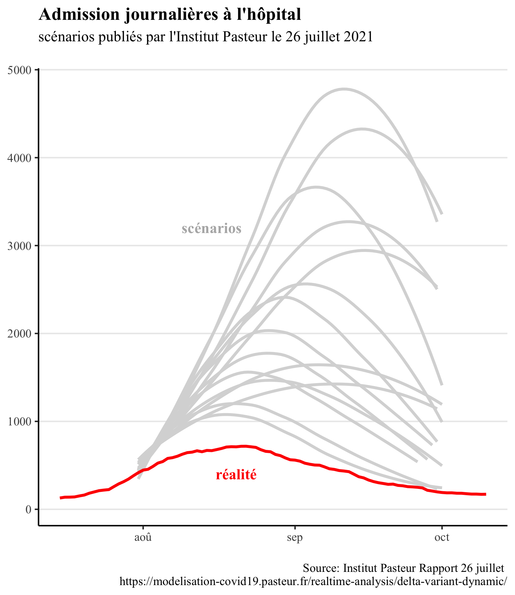
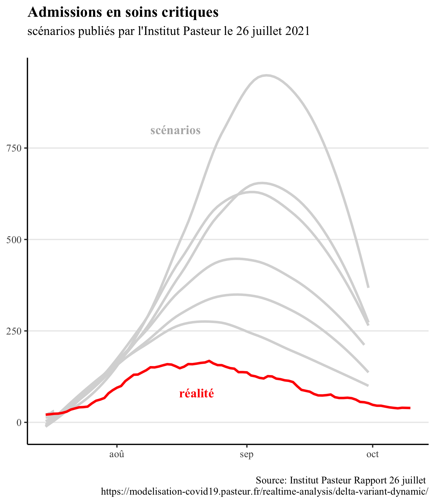
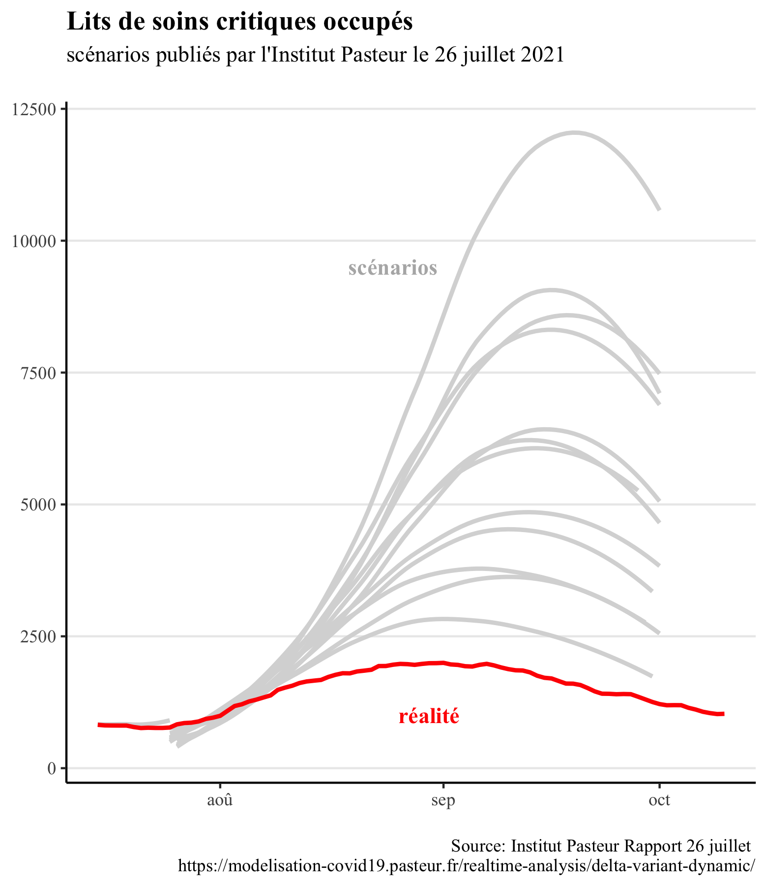

<link href="_assets/image.css" rel="stylesheet">

## Pourquoi évaluer les scénarios de modélisation est-il important?

Les scénarios de modélisation jouent un rôle primordial dans les politiques publiques mises en place depuis le début de la pandémie de covid-19. 
Par conséquent, pour pouvoir prendre de bonnes décisions, il est important d'avoir des scénarios de modélisation qui permettent de bien anticiper la réalité.
  

Par exemple, ce sont des <a href="https://www.imperial.ac.uk/mrc-global-infectious-disease-analysis/covid-19/report-9-impact-of-npis-on-covid-19/">scénarios de modélisation</a> qui ont conduit beaucoup de gouvernement à ne pas se limiter aux mesures traditionelles de lutte contre les épidémies (interdiction de grands rassemblements, fermetures d'écoles et de lieux de travail, et isolement des malades) pour aller vers un confinement strict.    
  
    

Ces modélisations prévoyaient qu'avec les mesures classiques (sans confinement), le nombre de patients en réanimations suivraient la courbe grise, tandis que la réalité est représentée par la courbe rouge.    
Cette exemple illustre l'importance que peuvent avoir les scénarios de modélisation, par exemple en décidant un gouvernement à mettre en place un confinement strict.

## Peut-on vraiment les évaluer?

Un argument souvent entendu au sujet des scénarios de modélisation est le suivant: comme le scénario permet d'anticiper le pire, il mène à prendre des mesures qui vont justement empêcher que le scénario modélisé se produisent, ce qui explique le décalage entre le scénario de modélisation et la réalité (où des mesures de freinage ont été prises!). Effectivement, il n'est pas possible d'établir une comparaison dans ce cas de figure.   
  
    
Cependant, les scnéarios de modélisation intègre souvent plusieurs hypothèses sur les mesures de freinage qui pourraient être mises en place. Ici, nous ne comparerons la réalité qu'**avec des scénarios où les mesures de freinage mises en place avaient aussi été modélisées.**   
    
Ainsi, la comparaison entre scénarios de modélisation et réalité permettra bien d'évaluer si ceux-ci ont bien anticipé la réalité.

Par exemple, lors de la 4ème vague, l'Institut Pasteur avait d'abord publié un rapport le 9 juillet. Après l'annonce de l'extension du pass sanitaire, l'Institut Pasteur a publié un nouveau rapport intégrant l'effet du pass sanitaire. Comparer les modélisations du rapport du 9 juillet avec la réalité n'est pas légitime, mais comparer les prévisions du rapport suivant avec la réalité oui (car l'impact des mesures y a déja été modélisé).   
      
Ces scénarios comparent les prévisions faites pour le mois d'août 2021 avec la réalité: comme les scénarios intègrent les mesures mises en place, la comparaison est possible. 

## Est-ce vraiment grave si les modélisations ne concordent pas avec la réalité? 

On peut penser qu'il vaut mieux surestimer la réalité et "prévoir systématiquement le pire", et donc mener les politiques à réagir avec un surplus de mesures pour limiter la propagation de l'épidémie. En réalité, la plupart des mesures de freinage de l'épidémie (confinement, couvre-feu, fermeture de classes, fermetures de lieux publics) ont des impacts sanitaires, sociaux et économiques négatifs. Par conséquent, surréagir face à l'épidémie n'est pas une bonne chose (de même que ne pas réagir assez). 
    

Des modélisations trop pessimistes peuvent ainsi conduire à maintenir en place des mesures restrictives qui ne seraient pas nécessaires. Par exemple, lorsque le gouvernement britannique a décidé de <a href="https://news.sky.com/story/covid-19-what-are-the-remaining-rules-in-england-after-freedom-day-12359221">lever</a> la plupart de ses mesures de restrictions (telles que limitations de capacité dans les lieux acceuillant du public, port du masque obligatoire ou encore limitations de déplacement) le 19 juillet 2021, sans non plus mettre en place un "pass sanitaire" pour accéder à des évenements ou lieux publics, cette initiative a été décriée par de nombreux <a href="https://www.thelancet.com/journals/lancet/article/PIIS0140-6736(21)01589-0/fulltext">scientifiques</a> comme "dangereuse et prématurée". Ces scientifiques s'appuyaient sur les modélisations de l'Imperial College pour annoncer "une troisième vague importante d'hospitalisations et de décès" à la suite de la levée des restricitons.    
     
 Pourtant, ces modélisations étaient largement pessimistes, et la catastrophe annoncée n'a pas eu lieu. Des modélisations non alignés avec la réalité ont donc failli empêcher un retour à une vie presque normale pour les Britanniques.  

