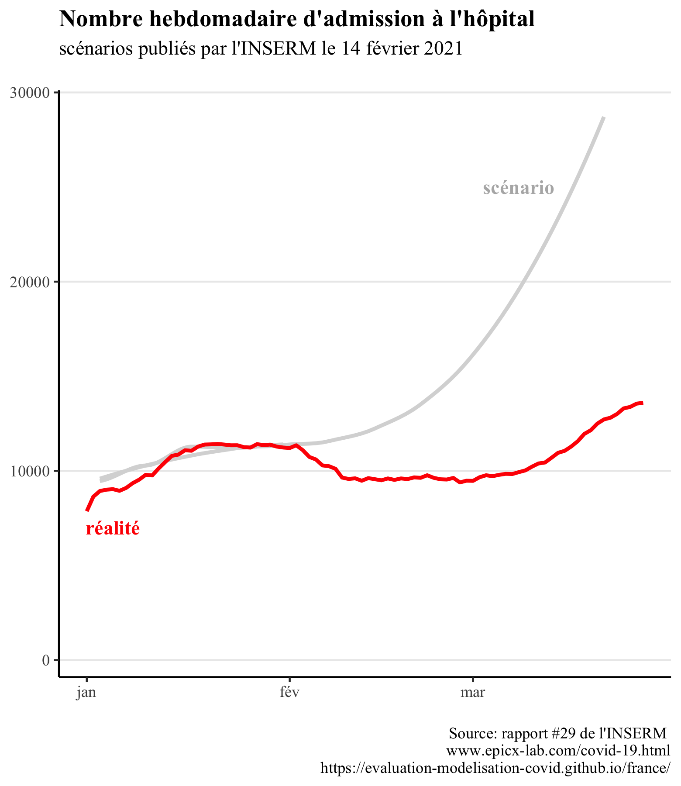
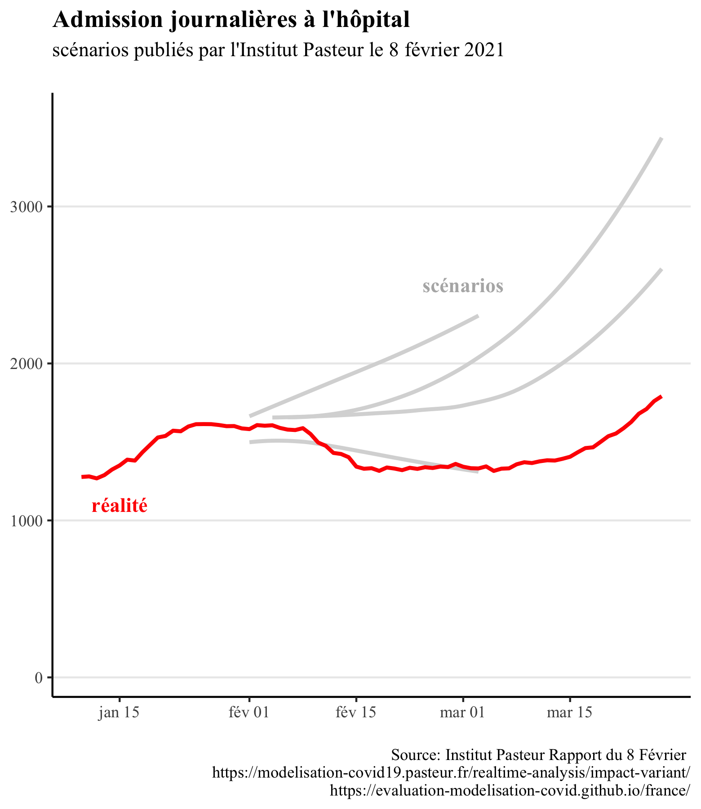

<link href="_assets/image.css" rel="stylesheet">

## Avant d'explorer les scénarios de modélisation

<b>
Quel intérêt à étudier la fiabilité des scénarios de modélisations?

</b>

Une explication plus détaillée est disponible sur la page <a href="https://evaluation-modelisation-covid.github.io/france/impact" class="btn">Impact</a>.

<b>
L'intérêt des modélisations n'est-il pas justement d'empêcher qu'elles se produisent?

</b>

Une explication plus détaillée est disponible sur la page <a href="https://evaluation-modelisation-covid.github.io/france/impact" class="btn">Impact</a>.

## Retour sur les principaux scénarios de modélisation 

<b>
1. Mars 2020: les modelisations qui ont conduit le monde à se confiner
  Explorer ce scénario

</b>

<h3>Contexte</h3> 

<h3>Comparaison des scénarios aux données réelles</h3> 

 

<b>
2. Modélisations de la 2ème vague, et deuxième confinement
  Explorer ce scénario

</b>

<h3>Contexte</h3> 
Le 26 octobre, l’Institut Pasteur produit des scénarios d’évolution de l’épidémie en l’absence de confinement. Ce rapport n’a à notre connaissance pas été rendu public, et nous n’avons pas pu le consulter. Nous avons simplement trouvé une figure extraite du rapport, que l’on peut trouver sur cette <a href="https://modelisation-covid19.pasteur.fr/realtime-analysis/hospital/"> page. </a>

Le 28 octobre, face à la perspective épidémique, Emmanuel Macron annonce un confinement généralisé, qui prendra effet le 30 octobre.

Le 30 octobre, l’Institut Pasteur produit une mise à jour de ses scénarios pour tenir compte de l’impact du confinement. Le rapport n’a pas été rendu public à notre connaissance. Certains médias y ont eu cependant accès, et ont reproduit les scénarios sous forme d’infographique. <a href="https://www.lesechos.fr/economie-france/social/covid-la-decrue-dans-les-services-de-reanimation-esperee-en-france-dans-une-dizaine-de-jours-1261656">L’article </a> des échos constitut notre source pour ce graphique.

<h3>Comparaison des scénarios aux données réelles</h3> 
  
Lors de son allocution du 28 octobre, Emmanuel Macron a annoncé que (citation quoique nous fassions nous dépasserons les 9000). Le pic réel sera deux fois moins élevé, à environ 4800 lits de soins critiques. 
  

   

<b>
3. Entre la deuxième et la troisième vague: le couvre-feu étendu
  Explorer ce scénario

</b>

<h3>Contexte</h3> 

<h3>Comparaison des scénarios aux données réelles</h3> 
  
<h4>Scénarios de l'INSERM</h4> 
  
Un certain nombre de mesures localisées et limitées n’ont pas été représentées sur le graphique, car il nous semble improbable qu’elles aient pu influer de manière significative la trajectoire épidémique nationale :

* 25 février : confinement le week-end à Dunkerke et une partie des Alpes-Maritimes
* 4 mars : Pas-de-Calais confiné le week-end, centre commerciaux de plus de 10 000 m2 fermés
 
Les mesures suivantes, susceptibles de modifier la trajectoires épidémiques et mises en place après la publication des scénarios, sont représentées sur le graphique :

* 18 mars : confinement de 16 départements
* 25 mars : 3 nouveaux départements confinés
* 3 avril : confinement de toute la France
  
    

<h4>Scénarios de l'Institut Pasteur</h4> 

Pour les courbes se prolongeant en mars, il s’agit de 2 scénarios : l’un sans vaccination, l’un avec des hypothèses optimistes de vaccination. Il est précisé qu’ « en pratique, l’impact de la campagne actuelle est susceptible d’être intermédiaire entre les scénarios avec et sans vaccination ».
  
 

<b>
4. Modélisations de la 4ème vague
  Explorer ce scénario

</b>

<h3>Contexte</h3> 
Un premier rapport de l’Institut Pasteur est sorti le <a href="https://modelisation-covid19.pasteur.fr/variant/Institut_Pasteur_dynamique_du_variant_Delta_en_France_metropolitaine_20210709.pdf">9 juillet 2021</a> dans un contexte de propagation du variant delta. Deux des trois scénarios présentés anticipaient un nombre de lits de soin critiques au moins égal à la 2ème vague fin août, et en l’absence de mesures un pic courant septembre bien au-dessus de la 1ere vague.

Face à la perspective d’une submersion hospitalière que suggéraient ces scénarios, le passe sanitaire a été acté le (date), entraînant une forte augmentation des vaccinations et rendant caduques les hypothèses  du rapport du 9 juillet. Pour remédier à cela, l’Institut Pasteur a publié 2 nouveaux rapports, les <a href="https://modelisation-covid19.pasteur.fr/variant/Institut_Pasteur_Acceleration_vaccination_et_Delta_20210726.pdf">26 juillet</a> et <a href="https://modelisation-covid19.pasteur.fr/variant/InstitutPasteur_Dynamiques_regionales_des_hospitalisations_20210805.pdf">5 août</a>, afin de tenir compte de l’effet du pass sanitaire ; ce sont ces 2 rapports que nous comparons à la trajectoire réelle.

<h3>Comparaison des scénarios aux données réelles</h3> 
  
<h4>Scénarios du 26 juillet</h4> 
  
  
  
<h4>Scénarios du 5 août</h4> 
  
    
  
En ligne avec les projections présentées, le président du conseil scientifique Jean-François Delfraissy prévoyait alors une situation compliquée lors de son audition <a href="https://www.publicsenat.fr/article/parlementaire/covid-19-jean-francois-delfraissy-prevoit-une-situation-tres-complexe-dans-les">devant les sénateurs: </a>
  
> « Le modèle montre bien que d’ici fin août, nous allons nous trouver dans une situation très complexe, avec un impact sur le système de soins »
  
Il <a href="https://www.publicsenat.fr/article/parlementaire/covid-19-jean-francois-delfraissy-prevoit-une-situation-tres-complexe-dans-les">prévoyait également</a> que l'on allait:
  
> « arriver aux 50 000 cas probablement début août » (le pic réel, atteint le 16 août, était 2 fois moindre, à <a href="https://www.gouvernement.fr/info-coronavirus/carte-et-donnees#situation_epidemiologique_-_nombre_moyen_de_nouveaux_cas_confirmes_quotidiens">moins de 25 000 cas </a> ).
 
Le deuxième rapport présente des courbes moins pessimistes ; cependant, à notre connaissance, seul le premier a bénéficié d’une couverture médiatique relayant ses résultats.

<b>
5. Levée des restrictions: Freedom Day au Royaume-Uni 
  Explorer ce scénario

</b>

<h3>Contexte</h3> 

Les modélisations présentées plus tôt permettent de comparer la réalité et les scénarios lorsque des restrictions sont en place. Mais comment se comparent les scénarios et la réalité dans le cas où les mesures de restrictions sont levées? Pour donner un élément de réponse à cette question, nous présentons une comparaison entre scénarios de modélisation et réalité dans le cas du "Freedom day", jour de levée de la quasi-totalité des mesures restrictives au Royaume-Uni. 
Le 19 juillet, dans le cadre de son plan de sortie de crise, le gouvernement britannique a en effet décidé de <a href="https://news.sky.com/story/covid-19-what-are-the-remaining-rules-in-england-after-freedom-day-12359221">lever</a> la plupart de ses mesures de restrictions (telles que limitations de capacité dans les lieux acceuillant du public, port du masque obligatoire ou encore limitations de déplacement). Contrairement à d'autres pays européens, ce retour à la normale ne comprenait pas la mise en place d'un "pass sanitaire" pour accéder à des évenements ou lieux publics. Cette levée des restrictions avait été fermement critiquée par de nombreux scientifiques dans une lettre ouverte au journal médical <a href="https://www.thelancet.com/journals/lancet/article/PIIS0140-6736(21)01589-0/fulltext">The Lancet</a>, qui l'avait qualifiée de "dangereuse et prématurée".

<h3>Comparaison des scénarios aux données réelles</h3> 

Les données présentées ci-dessous comparent la réalité avec les différents scénarios de modélisations visant à prévoir l'impact de la levée des restrictions. Les données sont <a href="https://assets.publishing.service.gov.uk/government/uploads/system/uploads/attachment_data/file/1001169/S1301_SPI-M-O_Summary_Roadmap_second_Step_4.2__1_.pdf">issues</a> 
 du rapport du 7 juillet du SAGE (Scientific Advisory Group for Emergencies), et la mise en forme provient du site du <a href="https://data.spectator.co.uk/category/sage-scenarios">Spectator</a>. Les données montrent l'évolution du nombre de patients covid hospitalisés au cours du temps.

