<link href="_assets/image.css" rel="stylesheet">

# Comment évaluer la fiabilité des modelisations mathématiques sur la propagation du covid-19?

La fiabilité d'un modele est évaluée en comparant ses prévisions avec la réalité. 
Avec markdown tu *peux* faire **beaucoup** de choses.
Des listes par exemple:
1. First item
2. Second item
3. Third item
4. Fourth item 

Mais aussi des tables :

| Syntax      | Description |
| ----------- | ----------- |
| Header      | Title       |
| Paragraph   | Text        | 

> Des citations

Et mettre une emphase sur certaines choses <mark>très importantes</mark>

<b>
1. Modélisations de la 2ème vague, et deuxième confinement
  Explorer ce scénario

</b>

<h3>Contexte</h3> 
Le 26 octobre, l’Institut Pasteur produit des scénarios d’évolution de l’épidémie en l’absence de confinement. Ce rapport n’a à notre connaissance pas été rendu public, et nous n’avons pas pu le consulter. Nous avons simplement trouvé une figure extraite du rapport, que l’on peut trouver sur cette <a href="https://modelisation-covid19.pasteur.fr/realtime-analysis/hospital/"> page. </a>

Le 28 octobre, face à la perspective épidémique, Emmanuel Macron annonce un confinement généralisé, qui prendra effet le 30 octobre.

Le 30 octobre, l’Institut Pasteur produit une mise à jour de ses scénarios pour tenir compte de l’impact du confinement. Le rapport n’a pas été rendu public à notre connaissance. Certains médias y ont eu cependant accès, et ont reproduit les scénarios sous forme d’infographique. <a href="https://www.lesechos.fr/economie-france/social/covid-la-decrue-dans-les-services-de-reanimation-esperee-en-france-dans-une-dizaine-de-jours-1261656">L’article </a> des échos constitut notre source pour ce graphique.

<h3>Comparaison des scénarios aux données réelles</h3> 
  
Lors de son allocution du 28 octobre, Emmanuel Macron a annoncé que (citation quoique nous fassions nous dépasserons les 9000). Le pic réel sera deux fois moins élevé, à environ 4800 lits de soins critiques. 
  

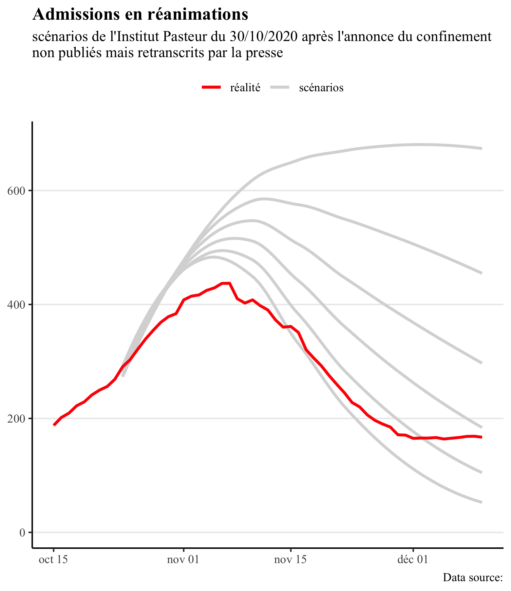 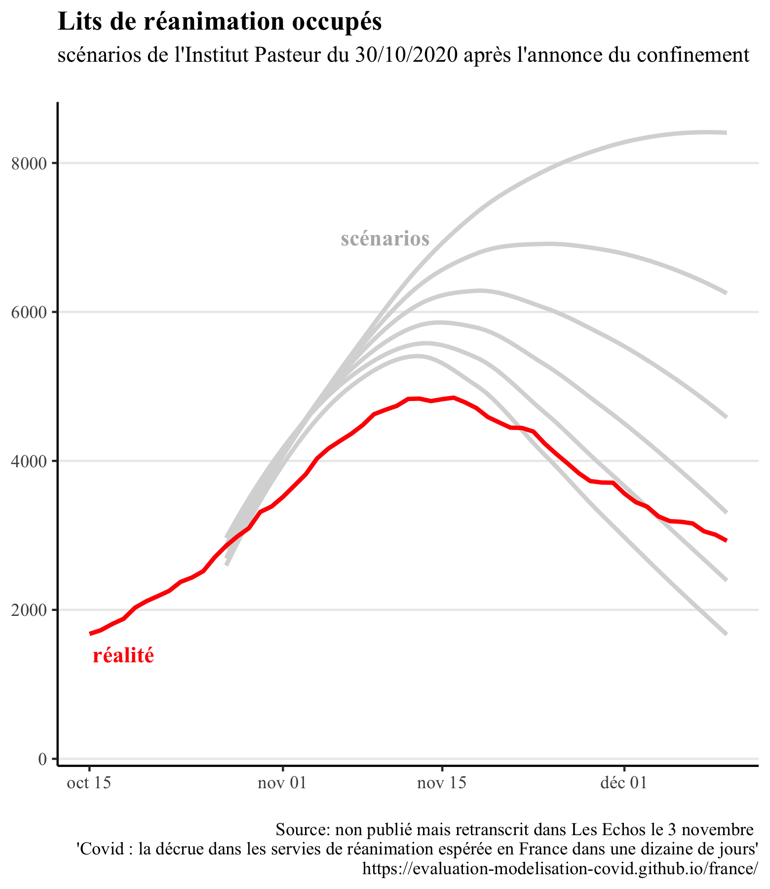  

<b>
2. Modélisations de la 4ème vague
  Explorer ce scénario

</b>

<h3>Contexte</h3> 
Un premier rapport de l’Institut Pasteur est sorti le <a href="https://modelisation-covid19.pasteur.fr/variant/Institut_Pasteur_dynamique_du_variant_Delta_en_France_metropolitaine_20210709.pdf">9 juillet 2021</a> dans un contexte de propagation du variant delta. Deux des trois scénarios présentés anticipaient un nombre de lits de soin critiques au moins égal à la 2ème vague fin août, et en l’absence de mesures un pic courant septembre bien au-dessus de la 1ere vague.

Face à la perspective d’une submersion hospitalière que suggéraient ces scénarios, le passe sanitaire a été acté le (date), entraînant une forte augmentation des vaccinations et rendant caduques les hypothèses  du rapport du 9 juillet. Pour remédier à cela, l’Institut Pasteur a publié 2 nouveaux rapports, les <a href="https://modelisation-covid19.pasteur.fr/variant/Institut_Pasteur_Acceleration_vaccination_et_Delta_20210726.pdf">26 juillet</a> et <a href="https://modelisation-covid19.pasteur.fr/variant/InstitutPasteur_Dynamiques_regionales_des_hospitalisations_20210805.pdf">5 août</a>, afin de tenir compte de l’effet du pass sanitaire ; ce sont ces 2 rapports que nous comparons à la trajectoire réelle.

<h3>Comparaison des scénarios aux données réelles</h3> 
  
<h4>Scénarios du 26 juillet</h4> 
  
  
  
<h4>Scénarios du 5 août</h4> 
  
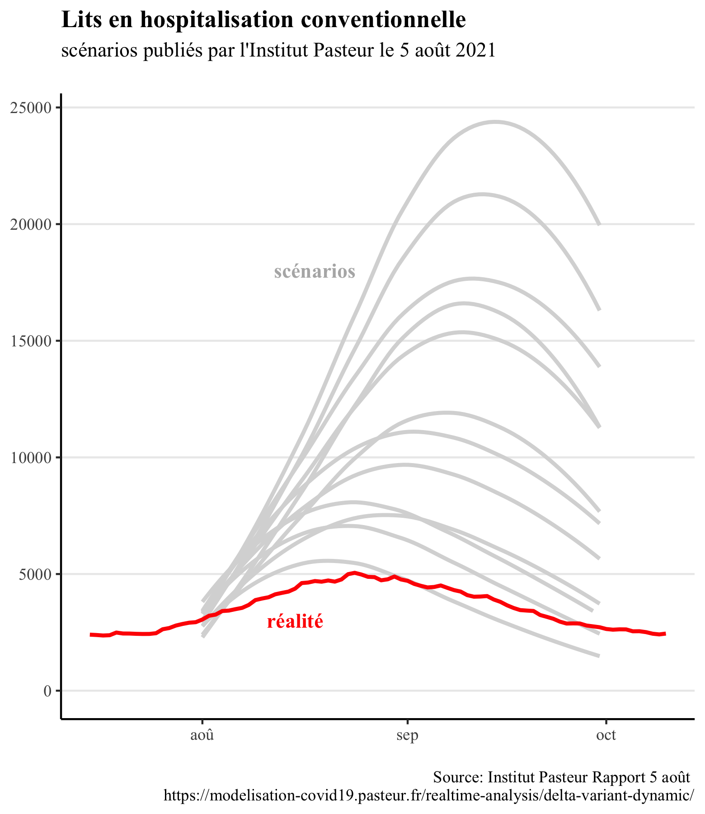 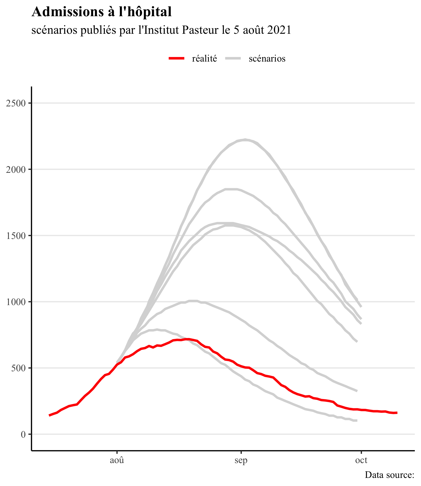 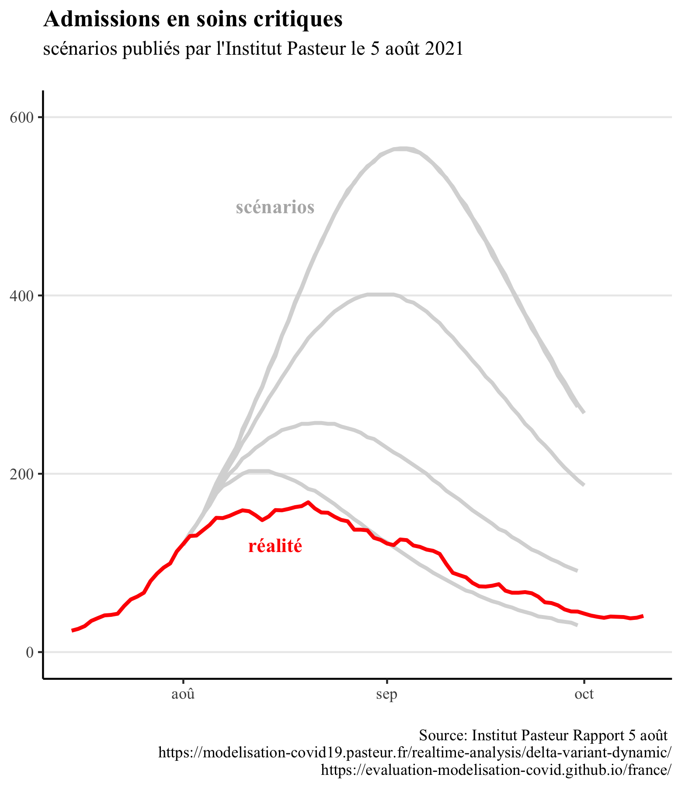 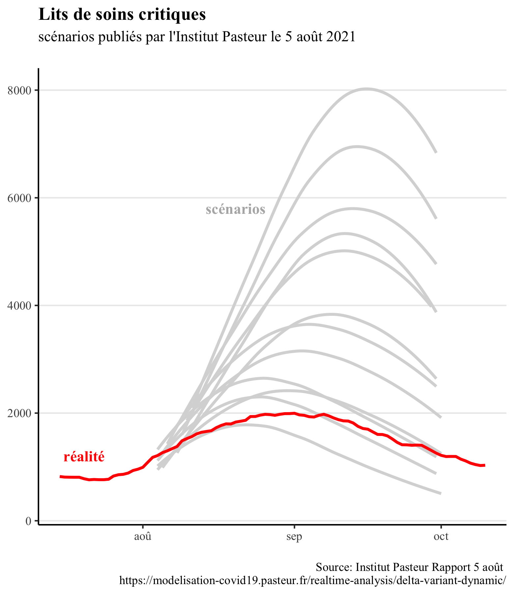 
  
En ligne avec les projections présentées, le président du conseil scientifique Jean-François Delfraissy prévoyait alors une situation compliquée lors de son audition <a href="https://www.publicsenat.fr/article/parlementaire/covid-19-jean-francois-delfraissy-prevoit-une-situation-tres-complexe-dans-les">devant les sénateurs: </a>
  
> « Le modèle montre bien que d’ici fin août, nous allons nous trouver dans une situation très complexe, avec un impact sur le système de soins »
  
Il <a href="https://www.publicsenat.fr/article/parlementaire/covid-19-jean-francois-delfraissy-prevoit-une-situation-tres-complexe-dans-les">prévoyait également</a> que l'on allait:
  
> « arriver aux 50 000 cas probablement début août » (le pic réel, atteint le 16 août, était 2 fois moindre, à <a href="https://www.gouvernement.fr/info-coronavirus/carte-et-donnees#situation_epidemiologique_-_nombre_moyen_de_nouveaux_cas_confirmes_quotidiens">moins de 25 000 cas </a> ).
 
Le deuxième rapport présente des courbes moins pessimistes ; cependant, à notre connaissance, seul le premier a bénéficié d’une couverture médiatique relayant ses résultats.

<!---Media (créer un onglet à part après)-->
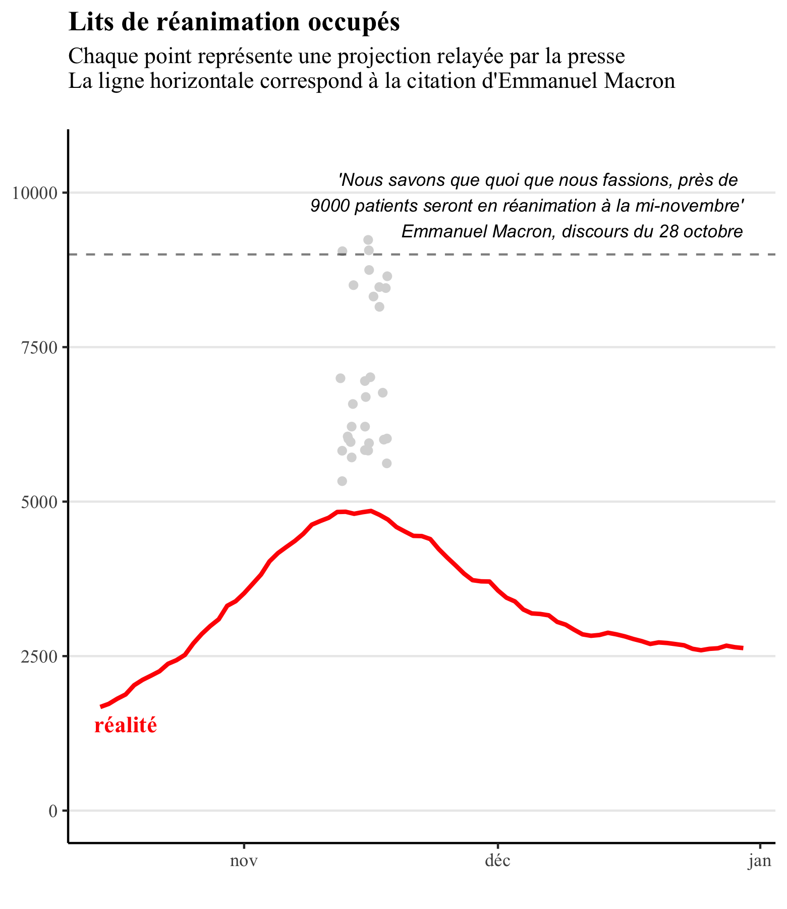  

<!---INSERM and Pasteur january-february (scenarios 16/01, 02/02, 08/02 and 14/02)-->
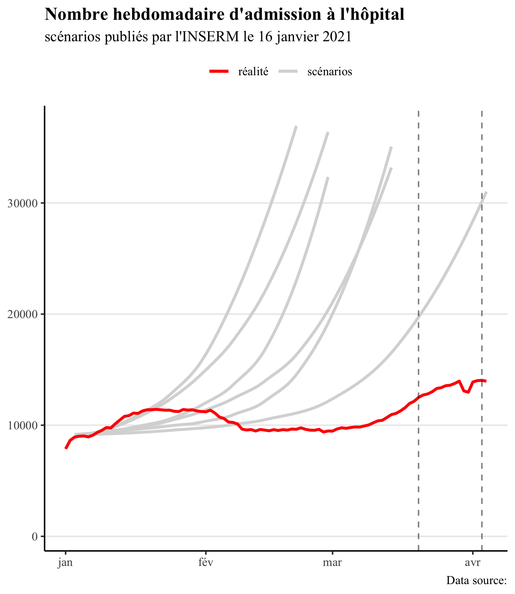 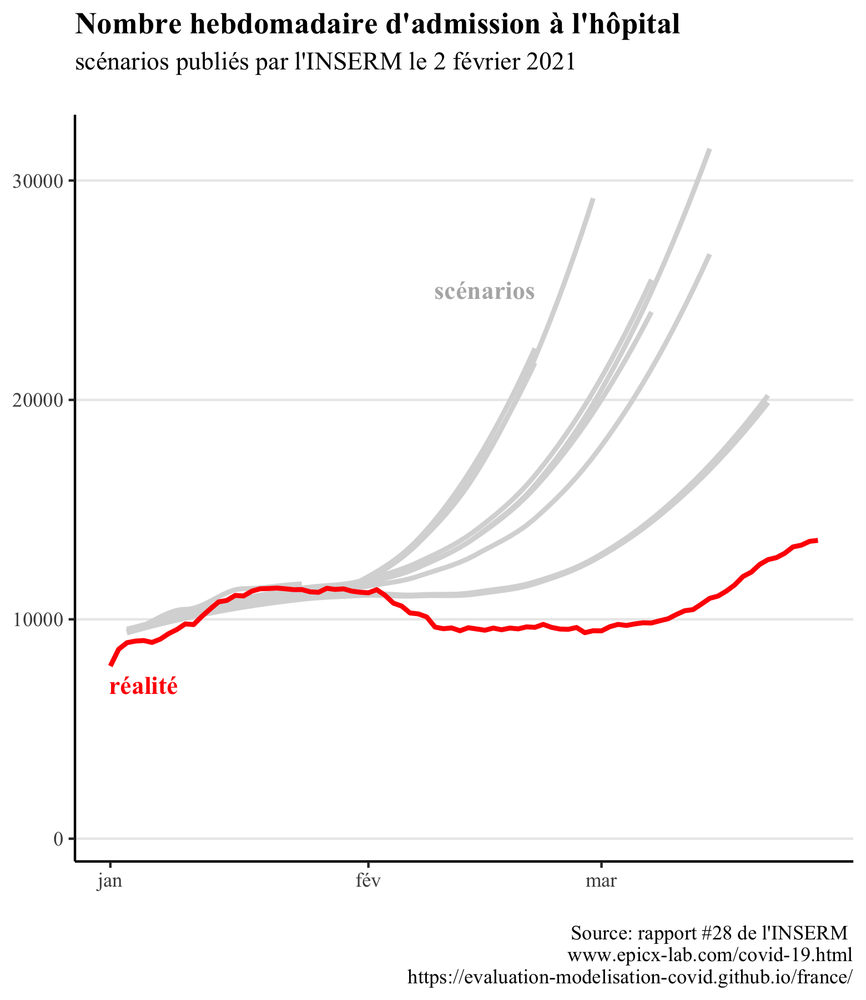 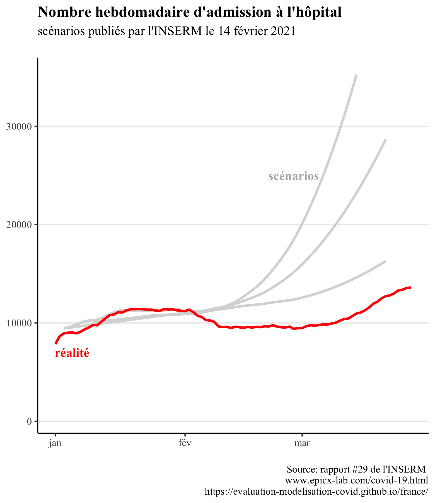  

<!---Pasteur october (scenario 25 september)-->
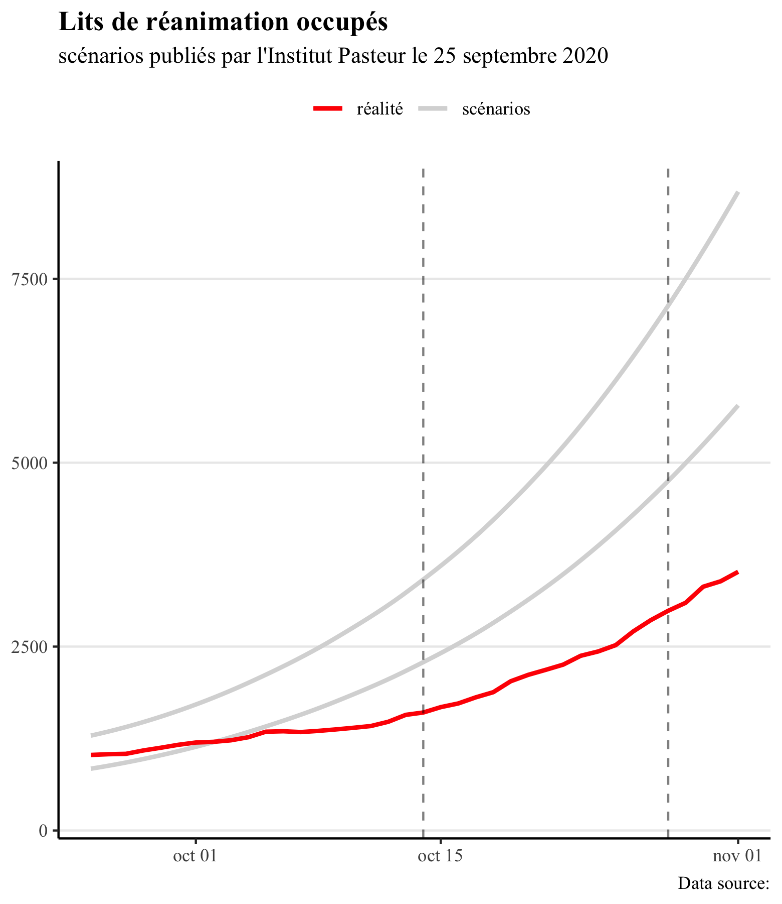 
 

# A quel moment des modélisations mathématiques ont éte faites, et quelle a éte leur fiabilité?


 
<ul>
 
<li><h3><a href="{{ post.url | relative_url }}">{{ post.title }}</a></h3></li>
 
</ul>


