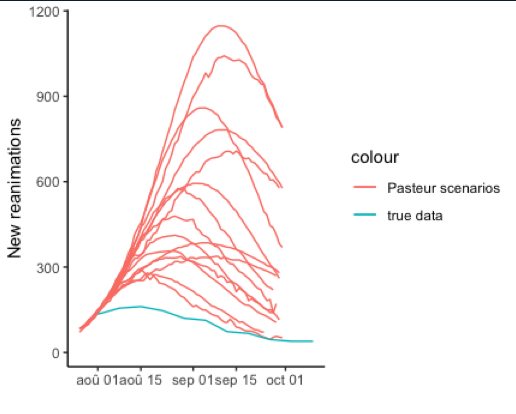

<a href="https://evaluation-modelisation-covid.github.io/france/about">Acceuil</a> <a href="https://evaluation-modelisation-covid.github.io/france/about">A propos</a>

  <a class="active" href="https://evaluation-modelisation-covid.github.io/france/about">Home</a>
  <a href="https://evaluation-modelisation-covid.github.io/france/about">News</a>
  <a href="https://evaluation-modelisation-covid.github.io/france/about">Contact</a>
  <a href="https://evaluation-modelisation-covid.github.io/france/about">About</a>

# Comment évaluer la fiabilité des modelisations mathématiques sur la propagation du covid-19?

La fiabilité d'un modele est évaluée en comparant ses prévisions avec la réalité. 

<b>Contexte</b>

#### même avec des images ;)

 

# A quel moment des modélisations mathématiques ont éte faites, et quelle a éte leur fiabilité?


 
<ul>
 
<li><h3><a href="{{ post.url | relative_url }}">{{ post.title }}</a></h3></li>
 
</ul>


