# Retour sur les modélisations covid-19

<link href="_assets/image.css" rel="stylesheet">

## Avant d'explorer les scénarios de modélisation

<b>
Quel intérêt à étudier la fiabilité des scénarios de modélisations?

</b>

Dans un cas de figure où les scénarios de modélisation sous-estiment l'évolution de l'épidémie (A), le risque est de ne pas réagir, ou pas assez. Inversement, si les scénarios surestiment l'évolution de l'épidémie (B), le risque est de surréagir et notamment de prendre trop de mesures aux effets déletères sans qu'elles soient justifiées. En effet, la plupart des mesures de freinage de l'épidémie (confinement, couvre-feu, fermeture de classes, fermetures de lieux publics) ont des impacts sanitaires, sociaux et économiques négatifs. Par conséquent, surréagir face à l'épidémie n'est pas une bonne chose (de même que ne pas réagir assez).   
  
    
  
Une explication plus détaillée est disponible sur la page <a href="https://evaluation-modelisation-covid.github.io/france/impact">impact.</a>

<b>
L'intérêt des modélisations n'est-il pas justement d'empêcher qu'elles se produisent?

</b>

Un argument souvent entendu au sujet des scénarios de modélisation est le suivant: comme le scénario permet d'anticiper le pire, il mène à prendre des mesures qui vont justement empêcher que le scénario modélisé se produisent, ce qui expliquent le décalage entre le scénario de modélisation et la réalité (où des mesures de freinage ont été prises!). Effectivement, il n'est pas possible d'établir une comparaison dans ce cas de figure.   
  
    
Cependant, les scénarios de modélisation intègre souvent plusieurs hypothèses sur les mesures de freinage qui pourraient être mises en place. Ici, nous ne comparerons la réalité qu'**avec des scénarios où les mesures de freinage mises en place avaient aussi été modélisées.**   
    
Ainsi, la comparaison entre scénarios de modélisation et réalité permettra bien d'évaluer si ceux-ci ont bien anticipé la réalité.

## Retour sur les principaux scénarios de modélisation 

### 1. Mars 2020: les modélisations qui ont conduit le monde à se confiner

<b>
Contexte
  Explorer ce scénario

</b>

En mars 2020, l'incertitude quant à l'impact qu'allait avoir le covid-19 était grande. Lorsque l'Italie a commencé à être fortement touchée, à la mi-mars, de nombreux pays européens ont réalisé que le covid-19 risquait d'avoir un impact significatif.  Pour prévoir l'évolution et l'impact de la pandémie, les décideurs se sont tournés vers le domaine de la modélisation épidémiologique. Une équipe de scientifiques de l'Imperial College (Londres), menée par le Professeur Neil Ferguson, a notamment publié le <a href="https://www.imperial.ac.uk/mrc-global-infectious-disease-analysis/covid-19/report-9-impact-of-npis-on-covid-19/">rapport</a> qui a conduit de nombreux gouvernements européens, dont le gouvernement <a href="https://www.lemonde.fr/planete/article/2020/03/15/coronavirus-les-simulations-alarmantes-des-epidemiologistes-pour-la-france_6033149_3244.html">français</a>, à confiner leur pays. Les scénarios présentés dans le rapport prédisaient, en l'absence de mesures strictes, plus de 500 000 morts en moins de 3 mois au Royaume-Uni. En revanche, le rapport avançait que la mise en place de mesures strictes (type confinement) permettrait de contenir la vague et d'éviter une saturation du système hospitalier. Se fiant à ce rapport, les gouvernements ont pour beaucoup choisi de mettre en place des mesures strictes afin de rester dans le deuxième scénario. Bien évidemment, les projections faites <em>en l'absence de mesures</em> ne peuvent être comparées avec ce qui s'est passé dans les pays confinés. C'est d'ailleurs l'un des contre-arguments les plus communs aux détracteurs des modèles épidémiologiques: c'est précisément grâce aux mesures que les scénarios de modélisation ne se sont pas réalisés.
  Mais il y a un pays qui nous permet de tester la validité des scénarios de modélisation: la Suède. Lors de la première vague, la Suède a choisi de ne pas se confiner, préférant se reposer des mesures plus légères. Il est donc possible de comparer ce que prévoyaient les scénarios pour la Suède et la réalité.

<b>
Comparaison des scénarios aux données réelles
  Explorer ce scénario

</b>

  
L'<a href="https://www.imperial.ac.uk/media/imperial-college/medicine/mrc-gida/Imperial-College-COVID19-Global-unmitigated-mitigated-suppression-scenarios.xlsx ">appendice du rapport 12 de l'Imperial College</a> contient des modélisations de l'épidémie en Suède.    

Les scénarios (en gris) modélisant un confinement strict tel qu'adoptés par les autres pays européens anticipaient un pic de réanimation compris entre 1200 et 6800 patient. La réalité (en rouge) a été de 550, soit 2 à 12 fois moins, alors même que la Suède n'a PAS confiné sa population. Nous avons aussi représenter la projection du modèle en l'absence de mesure (qui ne représente pas la réalité, la Suède n'ayant pas "rien fait"). Cela permet d'imaginer le résultat si les chercheurs avaient modélisé l'approche effectivement suivie par la Suède, le résultat se trouvant quelque part entre un confinement strict et l'absence de mesure.   

Les modèles épidémiologiques qui ont conduit le monde à se confiner surestimaient très largement saturation du système hospitalier en l'absence de confinement, au moins dans le cas de la Suède. 
  
 

    

<b>
Impact politique et médiatique
  Explorer ce scénario

</b>

  
Ces modélisations ont eu un impact majeur. En effet, elles furent un des principaux élément déclencheur du confinement national français (qui influencera d'autres pays européens à suivre la même voie). Ainsi, dans son <a href="https://solidarites-sante.gouv.fr/IMG/pdf/avis_conseil_scientifique_12_mars_2020.pdf">rapport du 12 mars 2020</a>, le Conseil Scientifique a affirmé que les mesures classiques utilisées pour limiter la propagation des épidémies ne permettraient pas de limiter suffisamment la circulation du virus, impliquant la nécessité d'un confinement strict ("on ne s’attend pas à ce que la réduction de la taille du pic épidémique soit suffisante pour éviter une saturation du système de santé. (...) Cette intuition a été illustrée à travers la réalisation d’un modèle COVID19 particulier (Neil Ferguson, communication personnelle).")
La figure présentée ci-dessus montrant que ces modèles surestimaient largement ce qui se passait avec des mesures classiques de contrôle des épidémies, cette affirmation était donc en réalité totalement fausse. 

  

<b>
2. Modélisations de la 2ème vague, et deuxième confinement
  Explorer ce scénario

</b>

<h3>Contexte</h3> 
Le 26 octobre, l’Institut Pasteur produit des scénarios d’évolution de l’épidémie en l’absence de confinement. Ce rapport n’a à notre connaissance pas été rendu public, et nous n’avons pas pu le consulter. Nous avons simplement trouvé une figure extraite du rapport, que l’on peut trouver sur cette <a href="https://modelisation-covid19.pasteur.fr/realtime-analysis/hospital/"> page. </a>

Le 28 octobre, face à la perspective épidémique, Emmanuel Macron annonce un confinement généralisé, qui prendra effet le 30 octobre.

Le 30 octobre, l’Institut Pasteur produit une mise à jour de ses scénarios pour tenir compte de l’impact du confinement. Le rapport n’a pas été rendu public à notre connaissance. Certains médias y ont cependant eu accès, et ont reproduit les scénarios sous forme d’infographie. <a href="https://www.lesechos.fr/economie-france/social/covid-la-decrue-dans-les-services-de-reanimation-esperee-en-france-dans-une-dizaine-de-jours-1261656">L’article </a> des échos constitue notre source pour ce graphique.

<h3>Comparaison des scénarios aux données réelles</h3> 
    

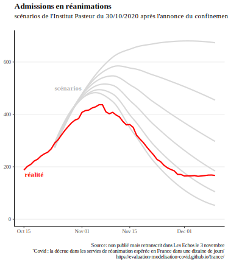 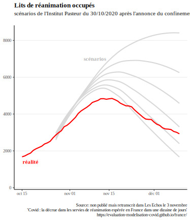     

<h3>Impact politique et médiatique</h3> 

Ces modélisations ont été un des élément déclencheur du 2ème confinement. Notamment, lors de son allocution du 28 octobre, Emmanuel Macron a annoncé que le nombre de patients en réanimation dépasserait les 9000 "quoi que nous fassions". Le pic réel sera deux fois moins élevé, à environ 4800 lits de soins critiques. On constate qu'en vue de justifier une décision politique, seule la modélisation la plus pessimiste a été mise en avant.   
Ces modélisations ont également été largement reprises dans la presse: <a href="https://www.lci.fr/sante/video-deuxieme-vague-les-scenarios-qui-inquietent-2168899.html">"Deuxième vague : les scénarios qui inquiètent"</a> titrait ainsi LCI après l'annonce du 2ème confinement, présentant les scénarios dont les pics de réanimation étaient de 5500, 6200 et 9000 patients. 

<b>
3. Entre la deuxième et la troisième vague: le couvre-feu étendu
  Explorer ce scénario

</b>

<h3>Contexte</h3> 

Au cours d'un hiver 2020-21 marqué par un couvre-feu prolongé, une dégradation de la situation sanitaire a mené l'INSERM et l'Institut Pasteur à publier des scénarios de modélisations. Ces scénarios ont notamment été utilisés par des scientifiques pour demander la mise en place d'un confinement strict début février.
  
<h3>Comparaison des scénarios aux données réelles</h3> 

<h4>Scénarios de l'INSERM</h4> 
  
Un certain nombre de mesures localisées et limitées n’ont pas été représentées sur le graphique, car il nous semble improbable qu’elles aient pu influer de manière significative la trajectoire épidémique nationale :

1. 25 février : confinement le week-end à Dunkerque et une partie des Alpes-Maritimes
2. 4 mars : Pas-de-Calais confiné le week-end, centre commerciaux de plus de 10 000 m2 fermés
 
Les mesures suivantes, susceptibles de modifier la trajectoire épidémique et mises en place après la publication des scénarios, sont représentées sur le graphique :

1. 18 mars : confinement de 16 départements
2. 25 mars : 3 nouveaux départements confinés
3. 3 avril : confinement de toute la France    
  
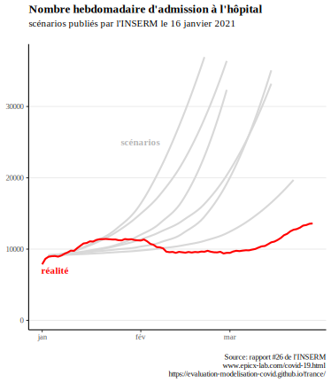 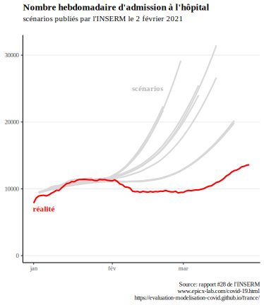  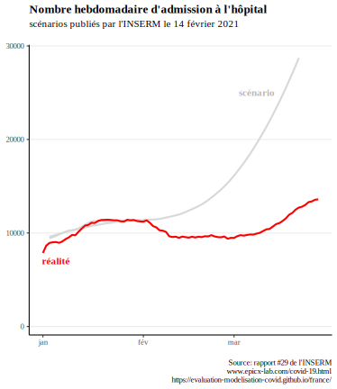    

<h4>Scénarios de l'Institut Pasteur</h4> 

Pour les courbes se prolongeant en mars, il s’agit de 2 scénarios : l’un sans vaccination, l’un avec des hypothèses optimistes de vaccination. Il est précisé qu’ « en pratique, l’impact de la campagne actuelle est susceptible d’être intermédiaire entre les scénarios avec et sans vaccination ».    
  
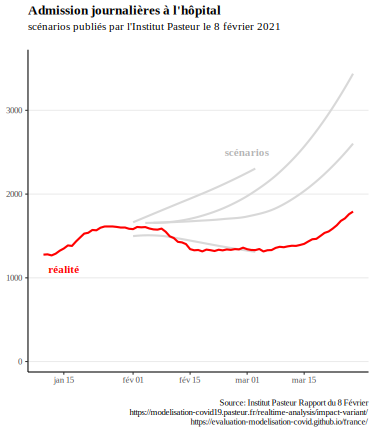    
<h3>Impact politique et médiatique</h3>
Les prévisions de l'INSERM ont été mises en avant dans un <a href="https://solidarites-sante.gouv.fr/IMG/pdf/note_eclairage_variants_modelisation_29_janvier_2021.pdf">rapport spécial</a> du Conseil Scientifique qui demandait la mise en place d'un confinement strict à partir du lundi 8 février 2021. Selon ces modélisations, le nombre d'hospitalisations hebdomadaires aurait dû être de plus de 30 000 à cette date (en réalité autour de 10 000), et continuer d'augmenter exponentiellement sans confinement strict (qui n'aura finalement lieu qu'un mois plus tard). 
  

<b>
4. Modélisations de la 4ème vague
  Explorer ce scénario

</b>

<h3>Contexte</h3> 
Un premier rapport de l’Institut Pasteur est sorti le <a href="https://modelisation-covid19.pasteur.fr/variant/Institut_Pasteur_dynamique_du_variant_Delta_en_France_metropolitaine_20210709.pdf">9 juillet 2021</a> dans un contexte de propagation du variant delta. Deux des trois scénarios présentés anticipaient un nombre de lits de soin critiques au moins égal à la 2ème vague fin août, et en l’absence de mesures un pic courant septembre bien au-dessus de la 1ere vague.

Face à la perspective d’une submersion hospitalière que suggéraient ces scénarios, le passe sanitaire élargi a été acté le 21 juillet, entraînant une forte augmentation des vaccinations et rendant caduques les hypothèses  du rapport du 9 juillet. Pour remédier à cela, l’Institut Pasteur a publié 2 nouveaux rapports, les <a href="https://modelisation-covid19.pasteur.fr/variant/Institut_Pasteur_Acceleration_vaccination_et_Delta_20210726.pdf">26 juillet</a> et <a href="https://modelisation-covid19.pasteur.fr/variant/InstitutPasteur_Dynamiques_regionales_des_hospitalisations_20210805.pdf">5 août</a>, afin de tenir compte de l’effet du pass sanitaire ; ce sont ces 2 rapports que nous comparons à la trajectoire réelle.

<h3>Comparaison des scénarios aux données réelles</h3> 
  
<h4>Scénarios du 26 juillet</h4> 
  
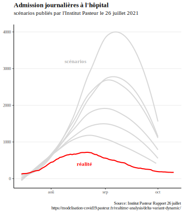 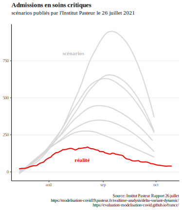     
  
<h4>Scénarios du 5 août</h4> 
  
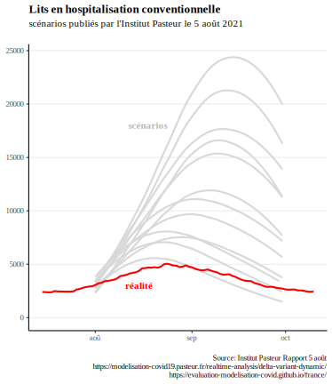 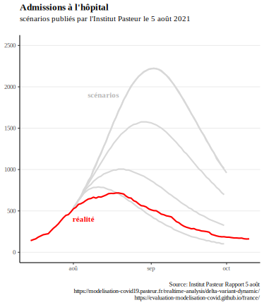 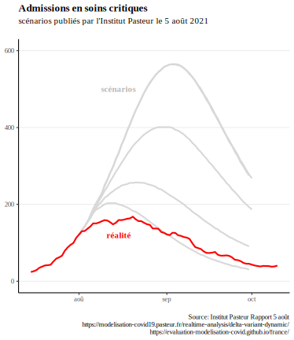 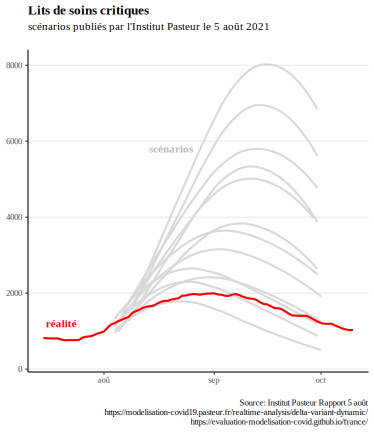    
  
<h3>Impact politique et médiatique</h3>
  
En ligne avec les projections présentées, le président du conseil scientifique Jean-François Delfraissy prévoyait alors une situation compliquée lors de son audition <a href="https://www.publicsenat.fr/article/parlementaire/covid-19-jean-francois-delfraissy-prevoit-une-situation-tres-complexe-dans-les">devant les sénateurs: </a>

Il <a href="https://www.publicsenat.fr/article/parlementaire/covid-19-jean-francois-delfraissy-prevoit-une-situation-tres-complexe-dans-les">prévoyait également</a> que l'on allait:

<blockquote>
  
" arriver aux 50 000 cas probablement début août " (le pic réel, atteint le 16 août, était 2 fois moindre, à <a href="https://www.gouvernement.fr/info-coronavirus/carte-et-donnees#situation_epidemiologique_-_nombre_moyen_de_nouveaux_cas_confirmes_quotidiens">moins de 25 000 cas 

</blockquote>

<blockquote>
  
" Le modèle montre bien que d’ici fin août, nous allons nous trouver dans une situation très complexe, avec un impact sur le système de soins "
Cette mise en avant des projections de l'Institut Pasteur au Sénat est intervenu avant que celui-ci ne se prononce sur l'extension du pass sanitaire, et a donc pu jouer un rôle dans l'avis des sénateurs sur la nécessité d'étendre le pass sanitaire.

</blockquote>
  

Les modélisations de l'Institut Pasteur ont été également utilisé par le Conseil d'Etat comme <a href="https://www.conseil-etat.fr/Media/actualites/documents/2021/07-juillet/454792-454818.pdf">argument</a> pour rejeter les demandes de référés-libertés au sujet de l'extension du pass sanitaire. Pour rejeter ces demandes, le Conseil d'Etat a notamment expliqué que les données "pourraient se révéler encore plus préoccupantes au début du mois d’août, selon les modélisations de l’Institut Pasteur".

<b>
5. Levée des restrictions: Freedom Day au Royaume-Uni 
  Explorer ce scénario

</b>

<h3>Contexte</h3> 

Les modélisations présentées plus tôt permettent de comparer la réalité et les scénarios lorsque des restrictions sont en place. Mais comment se comparent les scénarios et la réalité dans le cas où les mesures de restrictions sont levées? Pour donner un élément de réponse à cette question, nous présentons une comparaison entre scénarios de modélisation et réalité dans le cas du "Freedom day", jour de levée de la quasi-totalité des mesures restrictives au Royaume-Uni. 
Le 19 juillet, dans le cadre de son plan de sortie de crise, le gouvernement britannique a en effet décidé de <a href="https://news.sky.com/story/covid-19-what-are-the-remaining-rules-in-england-after-freedom-day-12359221">lever</a> la plupart de ses mesures de restrictions (telles que limitations de capacité dans les lieux accueillant du public, port du masque obligatoire ou encore limitations de déplacement). Contrairement à d'autres pays européens, ce retour à la normale ne comprenait pas la mise en place d'un "pass sanitaire" pour accéder à des événements ou lieux publics. 

<h3>Comparaison des scénarios aux données réelles</h3> 

Les données présentées ci-dessous comparent la réalité avec les différents scénarios de modélisations visant à prévoir l'impact de la levée des restrictions. Les données sont <a href="https://assets.publishing.service.gov.uk/government/uploads/system/uploads/attachment_data/file/1001169/S1301_SPI-M-O_Summary_Roadmap_second_Step_4.2__1_.pdf">issues</a> 
du rapport du 7 juillet du SAGE (Scientific Advisory Group for Emergencies), et la mise en forme provient du site du <a href="https://data.spectator.co.uk/category/sage-scenarios">Spectator</a>. Les données montrent l'évolution du nombre de patients covid hospitalisés au cours du temps.    

 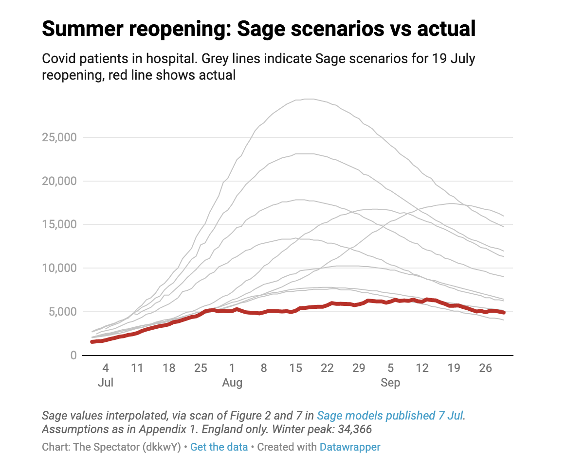
  
<h3>Impact politique et médiatique</h3>
Cette levée des restrictions avait été fermement critiquée par de nombreux scientifiques dans une lettre ouverte au prestigieux journal médical <a href="https://www.thelancet.com/journals/lancet/article/PIIS0140-6736(21)01589-0/fulltext">The Lancet</a>, qui l'avait qualifiée de "dangereuse et prématurée". Cette lettre ouverte a été reprise par différents médias  <a href="https://www.dailymail.co.uk/news/article-9766759/Experts-sign-letter-condemning-Government-s-dangerous-unethical-experiment.html">britanniques</a> et <a href="https://edition.cnn.com/2021/07/18/uk/boris-johnson-covid-gamble-freedom-day-intl-gbr-cmd/index.html">internationaux</a>, qui s'appuyaient sur les modélisations de l'Imperial College pour annoncer "une troisième vague importante d'hospitalisations et de décès" à la suite de la levée des restrictions. Le fait que les modélisations aient largement surestimées l'impact de la réouverture a été <a href="https://www.nature.com/articles/d41586-021-02125-1">décrit</a> dans le journal scientifique Nature par un épidémiologiste renommé: "Personne ne comprend vraiment ce qu'il se passe."

<b>
6. Seconde vague delta, décembre 2021 
  Explorer ces projections

</b>

  
  <h3>Contexte</h3> 
  
Une critique souvent apportée à la comparaison des données réelles aux “scénarios” telle que réalisée ci-dessus est que ces derniers ne constituent pas des “prédictions”, et servent simplement à donner une idée des grandes tendances et de l’impact de différentes mesures.   

Néanmoins, au-delà des scénarios présentés dans ses rapports, l’Institut Pasteur publié également des “Projection à court terme des besoins hospitaliers” sur <a href = https://modelisation-covid19.pasteur.fr/realtime-analysis/hospital/> cette page </a>, régulièrement mise à jour. Ici, le but est bien de prévoir correctement le nombre de malades, l’Institut précisant que “l’erreur relative pour les projections du nombre de lits de soins critiques au niveau national est de 11% à 14 jours.“   

Nous comparons ici la projection du modèle 2 semaines avant le pic de la seconde vague delta de mi-décembre 2021. Ce pic est intervenu juste avant l’émergence du variant omicron, qui a changé la donne dans les semaines qui ont suivi.   

  
  
  
  <h3>Comparaison des projections aux données réelles</h3> 
  
  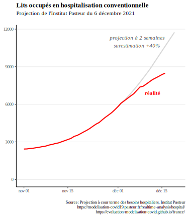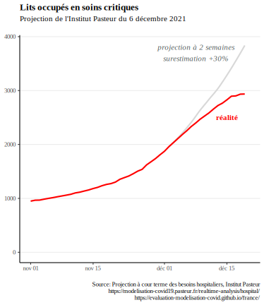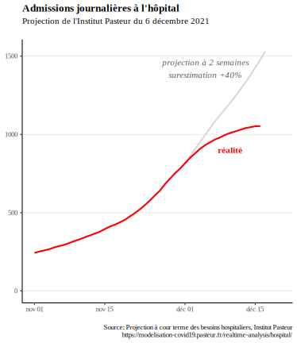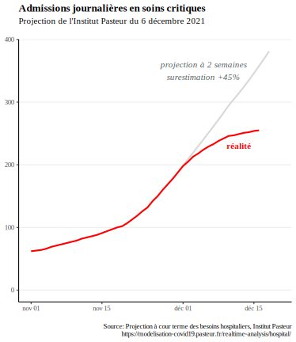
  
  Au moment du pic du variant delta, la projection du modèle correspond à une surestimation de 30% pour les lits de soins critiques, et d’environ 40% pour les autres indicateurs.   

Malgré une précision moyenne de 10% du modèle selon l’Institut Pasteur, au moment du pic, l’erreur réelle aura été bien plus élevée. Nous aurions souhaité comparer les projections du modèle aux autres pics (février 2021, avril 2021, août 2021) afin d’évaluer s’il s’agissait d’une erreur ponctuelle ou d’un biais systématique.   

Malheureusement la mise à jour régulière des projections sur la page présentant les résultats écrase les projections publiées précédemment, et nous n’avons pas pu effectuer cette évaluation systématique. Une conservation des résultats précédents en open data aiderait une telle démarche et une appropriation par le public.   

  

